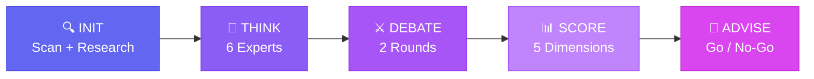
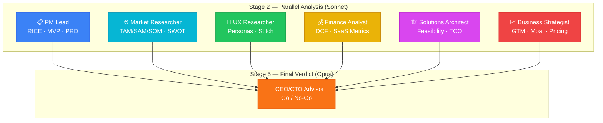

<p align="center">
  
  
  
  
</p>

<h1 align="center">🏛️ Gang</h1>
<h3 align="center">Multi-Agent Business Committee for Claude Code</h3>

<p align="center">
  <strong>One command. Six experts. One verdict.</strong><br/>
  Turn your IDE into a boardroom — 6 domain experts analyze, debate, and score your product idea,<br/>
  then a CEO/CTO advisor delivers a Go/No-Go recommendation.
</p>

<p align="center">
  <code>/gang run</code>
</p>

---

## ⚡ Quick Start

```bash
# 1️⃣ Add the marketplace
claude plugin marketplace add https://github.com/ebnrdwan/GangPlugin

# 2️⃣ Install the plugin
claude plugin install gang

# 3️⃣ Run on any project
/gang run
```

---

## 🔍 The Gap

AI tools are great at **building** — but nobody's asking **whether you should build it**.

> 💡 Engineers ship features nobody asked for. Founders chase markets that don't exist.
> Teams build before validating. **The cost isn't the code — it's the months spent building the wrong thing.**

Gang embeds a complete business evaluation pipeline in your development environment:

- 🔬 **Deep codebase understanding** before asking you anything
- 🌐 **Automated competitive research** via web search
- ⚔️ **Multi-perspective adversarial debate** (not single-agent advice)
- 📊 **Quantified scoring** across market, UX, feasibility, finance, and strategy
- 🎨 **Google Stitch-ready UI specs** that flow from strategic decisions
- 🚨 **Kill switches** — explicit checkpoints to exit early if assumptions break

---

## 🔄 How It Works



| Command | Stage | What Happens |
|---------|-------|-------------|
| `/gang init` | 🔍 INIT | Deep project scan → competitive research → targeted questions |
| `/gang think` | 🧠 THINK | 6 experts analyze independently in parallel |
| `/gang debate` | ⚔️ DEBATE | 2 rounds of structured cross-review + stress-testing |
| `/gang score` | 📊 SCORE | Plans scored on 5 dimensions (1-10 + confidence %) |
| `/gang advise` | 👔 ADVISE | CEO/CTO delivers Go/No-Go with kill switches + roadmap |

---

## 👥 The Committee



| Expert | Focus |
|--------|-------|
| 📋 **PM Lead** | RICE prioritization, MVP scope, requirements |
| 🌐 **Market Researcher** | TAM/SAM/SOM, competitive analysis, SWOT |
| 🎨 **UX Researcher** | Personas, journeys, design tokens, Stitch instructions |
| 💰 **Finance/Risk Analyst** | DCF, SaaS metrics, risk matrix, scenario modeling |
| 🏗️ **Solutions Architect** | Feasibility, architecture, build-vs-buy TCO |
| 📈 **Business Strategist** | GTM strategy, business model, competitive moat |
| 👔 **CEO/CTO Advisor** | Go/No-Go verdict, kill switches, implementation roadmap |

---

## 📖 Full Documentation

See **[gang/README.md](gang/README.md)** for:

- 📋 Detailed stage breakdown with examples
- 🎯 6 real-world use cases
- 📁 Output artifacts reference
- 🎨 Google Stitch & Impeccable design integration
- ⚖️ Comparison with alternatives
- 🧰 Expert frameworks reference

---

## 📄 License

MIT — use it, fork it, build on it.
