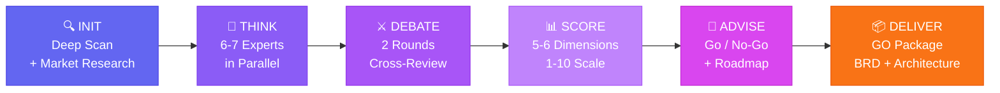
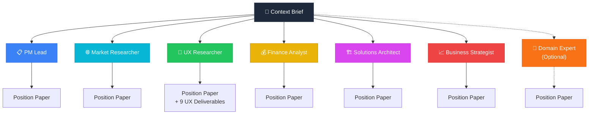
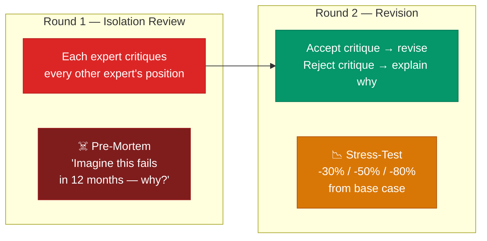

<p align="center">
  
  
  
  
  
</p>

<h1 align="center">🏛️ Gang — Multi-Agent Business Committee</h1>

<p align="center">
  <strong>One command. Seven experts. One verdict.</strong><br/>
  Gang turns Claude Code into a boardroom — 6 experts + 1 optional Domain Expert independently analyze your product idea,<br/>
  debate each other's positions, and a CEO/CTO advisor delivers a scored Go/No-Go recommendation with build-ready deliverables.
</p>

<p align="center">
  <code>/gang run</code>
</p>

---

## 🚨 The Gap

Today's AI-assisted development is great at **building** — but terrible at deciding **what to build and why**.

| | What Exists Today | What's Missing |
|---|---|---|
| 🤖 | AI coding assistants that generate code fast | No structured framework to evaluate whether the code *should* be written |
| 💬 | Single-perspective AI advice ("here's what I think") | Multi-perspective adversarial analysis that stress-tests assumptions |
| 🧩 | Product strategy tools across 5 different SaaS platforms | One command that scans your codebase, researches competitors, and delivers a complete analysis |
| 🎲 | Go/No-Go decisions made on gut feel in Slack threads | Quantified scoring across market viability, feasibility, finance, UX, and strategy — with kill switches |
| 🎨 | Design tools disconnected from business strategy | UX deliverables (personas, journeys, design tokens) that flow directly into Google Stitch |
| 🔍 | Competitive analysis as a separate manual research task | Automated competitive scan built into the evaluation pipeline |

> 💡 **The core problem:** Engineers ship features nobody asked for. Founders chase markets that don't exist. Teams build before validating.
> **The cost isn't the code — it's the months spent building the wrong thing.**

**Gang closes this gap** by embedding a structured business evaluation pipeline directly in your development environment — where the decisions actually happen.

---

## 🔄 How It Works



Run `/gang status` at any point to see exactly where you are:

```
🏛️ Gang Committee Status
━━━━━━━━━━━━━━━━━━━━━━━━
Session: gang-20260329-143022
Started: 2026-03-29
Domain Expert: enabled

[✓] Stage 1: INIT — Context brief ready
[✓] Stage 2: THINK — 7/7 position papers complete
[✓] Stage 3: DEBATE — 2 rounds complete, debate log compiled
[→] Stage 4: SCORE — Scoring in progress...
[ ] Stage 5: ADVISE — Not started
[ ] Stage 6: DELIVER — Not started (requires GO verdict)

Artifacts:
  .gang/context-brief.md .............. ✓
  .gang/domain-expert-profile.md ...... ✓
  .gang/competitive-scan.md ........... ✓
  .gang/position-papers/ .............. 7 files ✓
    ├── gang-pm-lead.md
    ├── gang-market-researcher.md
    ├── gang-ux-researcher.md
    ├── gang-finance-risk-analyst.md
    ├── gang-solutions-architect.md
    ├── gang-business-strategist.md
    └── gang-domain-expert.md
  .gang/ux-deliverables/ .............. 9 files ✓
  .gang/debate/round-1/ ............... 7 files ✓
  .gang/debate/round-2/ ............... 7 files ✓
  .gang/debate-log.md ................. ✓
  .gang/scored-plans.md ............... in progress
  .gang/executive-brief.md ............ pending
  .gang/go-package/ ................... pending

Next: Waiting for Stage 4 to complete, then run /gang advise
```

---

### 🔍 Stage 1 — INIT: Understand Everything First

Gang doesn't start with generic questions. It starts by **understanding your project deeply**:

| Step | What Happens |
|------|-------------|
| 1️⃣ **Deep codebase scan** | Tech stack, features, architecture, domain model, auth flows, monetization signals, data sources |
| 2️⃣ **Present understanding** | Shows what it found and asks you to confirm — *"Does this look right?"* |
| 3️⃣ **Competitive research** | Finds 5-8 competitors via web search, analyzes pricing, features, market gaps |
| 4️⃣ **Targeted questions** | Only asks what it couldn't determine — questions reference YOUR project and YOUR competitors by name |

<details>
<summary>💡 <strong>Example: Feature-level evaluation</strong></summary>

```
/gang init

I need to build a stock details page including prices, technical analysis,
fundamental analysis, news, signals (intraday/swing), calendar, predictions,
buy zones — and if I'm holding a position it should be marked.

Design reference: web application/stitch/projects/6261359687710202709/screens/...
```

Gang will scan your codebase, find that it's a stock analysis app, research TradingView/TrendSpider/Trade Ideas as competitors, and then ask smart questions like:

> *"Your codebase shows a SaaS subscription model — should the committee evaluate premium tier features for this page?"*

</details>

<details>
<summary>📋 <strong>Example: What INIT output looks like</strong></summary>

```
📋 Project Understanding
━━━━━━━━━━━━━━━━━━━━━━━
Product: StockInsight
Type: Web Application (Next.js + Spring Boot)
Stack: TypeScript, Kotlin, PostgreSQL, Redis, TradingView Widgets
Domain: Stock analysis platform for retail traders

Features Found:
  • Real-time price streaming via WebSocket
  • Watchlist management with alerts
  • Portfolio tracking with P&L calculation
  • News aggregation from multiple feeds
  • Basic charting with TradingView integration

Evaluation Subject: Stock Details Page
  Build a comprehensive stock details page including prices,
  technical analysis, fundamental analysis, news, signals
  (intraday/swing), calendar, predictions, and buy zones.
  Position markers for held stocks.

🌐 Competitive Scan
━━━━━━━━━━━━━━━━━━
Found 6 competitors:
  1. TradingView ........... Freemium · $14.95-59.95/mo · Most features
  2. TrendSpider ........... SaaS · $22-67/mo · AI-powered analysis
  3. Trade Ideas ........... SaaS · $118-228/mo · Scanning + signals
  4. Finviz ................ Freemium · $39.50/mo · Screening focus
  5. Stock Analysis ........ Freemium · $9.99/mo · Fundamental focus
  6. Seeking Alpha ......... Freemium · $19.99/mo · Community + news

Table-stakes: Real-time quotes, charting, watchlists, news
Gaps: Unified TA+FA on one page, position-aware signals, buy zone overlays

Does this look right? Anything I'm missing?
```

</details>

---

### 🧠 Stage 2 — THINK: Six (or Seven) Experts, Zero Groupthink

Six core experts (plus an optional Domain Expert) analyze independently and in parallel — **no agent sees another's work** (prevents anchoring bias):



| Expert | Model | What They Produce |
|--------|-------|-------------------|
| 📋 **PM Lead** | Sonnet | Scope definition, RICE prioritization, MoSCoW requirements, MVP boundary, PRD |
| 🌐 **Market Researcher** | Sonnet | TAM/SAM/SOM sizing, 12-dimension competitive scoring, Porter's Five Forces, SWOT, battle cards |
| 🎨 **UX Researcher** | Sonnet | Personas, JTBD, journey maps, wireframes, design tokens, accessibility notes, **Google Stitch instructions** |
| 💰 **Finance/Risk Analyst** | Sonnet | DCF valuation, SaaS metrics (ARR/MRR/churn/CAC/LTV/NRR), risk matrix, scenario modeling (base/bull/bear/stress) |
| 🏗️ **Solutions Architect** | Sonnet | Feasibility scoring, architecture, tech stack evaluation, build-vs-buy TCO, tech debt scoring, DORA metrics, ADRs |
| 📈 **Business Strategist** | Sonnet | Business Model Canvas, GTM strategy (3 phases), competitive moat, pricing tiers, differentiation analysis |
| 🔬 **Domain Expert** *(optional)* | Sonnet | Industry SME — regulatory landscape, domain benchmarks, table-stakes vs differentiators, compliance requirements |

All agents run in **a single parallel dispatch** — you see results as each expert finishes:

<details>
<summary>📋 <strong>Real output: PM Lead on a stock details page</strong></summary>

> **Bottom Line:** Ship 6 sections of the Stock Details Page in 5 weeks. Defer XGBoost Price Outlook and Market Regime Badge because the ML bugs are unresolved — broken predictions are worse than absent ones.
>
> **Key decisions:**
> 1. **MVP vs v2 split.** Six sections in v1 (Header, Chart, Indicators, Patterns, Position Banner, Intelligence Stream), four deferred. The RICE scores expose the real finding: 5 of the 6 v1 sections have zero new backend work required.
> 2. **Critical path finding.** Build Indicators + Patterns + News + Header first (all unblocked today), then add the chart once the OHLCV endpoint is done. The page ships value before the chart lands.
> 3. **Free vs Premium gating.** AI recommendation badge and confidence percentage are the Pro paywall anchor. Basic chart and indicators are free — gating standard indicators drives users to TradingView.
> 4. **ML section deferred with clear re-entry condition.** XGBoost Price Outlook deferred until backtested accuracy exceeds 60% on a 90-day holdout. No feature flag shipped without that gate.

</details>

<details>
<summary>🌐 <strong>Real output: Market Researcher competitive scoring</strong></summary>

> **Market Sizing:**
> - Bottom-up TAM: $1.35B (3M paying retail traders x $450/yr average spend). The context brief's $8B figure conflates raw data licensing with the pure SaaS tools layer.
> - SAM: $840M–$1.26B. SOM Year 1: $600K–$3M ARR at 1,000–5,000 users.
>
> **Competitive Scores (weighted):**
> - TradingView: 4.35/5 · TOS: 3.75/5 · Trade Ideas: 3.35/5 · TrendSpider: 3.15/5 · StockInsight now: 2.55/5
> - TOS (thinkorswim, free with Schwab) is underrated in the brief — it is a significant free substitute on the stock detail surface.
>
> **Biggest Risk Flagged:** The yfinance redistribution legal status is the highest-risk unresolved supplier issue — if exchange agreements prohibit redistribution to paying users, the fundamentals section requires a paid data provider, compressing margins.

</details>

<details>
<summary>🏗️ <strong>Real output: Solutions Architect code-level findings</strong></summary>

> **Feasibility: 7/10.** The Stock Details Page is buildable in 6 weeks for a solo founder — but only with deliberate scope cuts.
>
> **What the code review revealed:**
> - `TradingChart.tsx` is fully built with proper dark theme and volume histogram. It is just not wired up — there is a placeholder div on the page where it should render. This is a half-day fix, not a multi-week build.
> - `MarketDataProvider` is well-designed with a proper ABC. `get_historical()` already exists on `YahooProvider`. The OHLCV endpoint is purely a serialization exercise.
> - Symbol is stored in component state, not the URL. This is a 20-minute fix that unblocks bookmarking and sharing — it should be the first commit.
>
> **The "STRONG BUY 94%" header badge is a lie.** The current `_derive_signal()` produces a ratio of bullish indicators to total factors. It is not a calibrated probability. Labeling it "94% confidence" would mislead traders and create SEC/FINRA surface area. Ship it as "Signal Confidence" with the honest computed value.

</details>

<details>
<summary>💰 <strong>Real output: Finance Analyst risk escalation</strong></summary>

> **Data Licensing — promoted to Risk Score 20 (was 8).** Serving scraped Yahoo Finance data to paying users almost certainly violates Yahoo's ToS and exchange redistribution agreements. The fix costs $29/mo (Polygon.io Basic). This must be resolved before the first paid user signs up.
>
> **ROI Per Section:** The Candlestick Chart, Technical Patterns, Intelligence Stream, and Position Banner are the highest-ROI sections — they drive daily return habits and differentiate from free tools without requiring ML model fixes.
>
> **Kill Switches (7 specific conditions):** Binary, time-bound financial triggers with prescribed actions — not general cautions.
>
> **Stress test conclusion:** At -50% revenue the business remains cash-flow positive (cash costs are only $1,074/mo). The real stress failure is founder motivation after 12 months at below-market compensation — a key-person risk, not a solvency risk.

</details>

<details>
<summary>📈 <strong>Real output: Business Strategist conversion funnel</strong></summary>

> **Core Strategic Argument:** The Stock Details Page is a three-job machine: **acquire** (free, indexable, shareable), **tease** (visible but locked), **retain** (sticky Pro features). The conversion funnel runs top-to-bottom on the page — every section has an assigned role.
>
> **Pricing tiers:**
> - Free: 1D chart, full technical indicators, 3 news items, price header
> - Starter ($29/mo): All timeframes, patterns, earnings, regime badge, fundamentals
> - Pro ($49/mo): AI Recommendation badge, XGBoost Outlook, Signal History, Position Banner
>
> The AI Recommendation badge as a blurred teaser in the page header is the single highest-ROI conversion trigger. It is visible on every page load, requires no ML work to implement as a teaser, and creates an immediate upgrade moment.
>
> **Critical Risk:** The ML accuracy problem is a load-bearing assumption under the entire Pro pricing tier. Do not gate revenue on broken features — launch Pro with rule-based signals labeled honestly. Shipping broken AI signals as a paid feature is a trust-destroying event that no marketing recovers from.

</details>

> 💡 **Notice how experts independently converged** on the same risks (yfinance licensing, ML accuracy) and the same recommendation (defer ML, ship rule-based signals first) — without seeing each other's work. This is the power of role-isolated parallel analysis.

---

### ⚔️ Stage 3 — DEBATE: Structured Adversarial Review

Two rounds of structured cross-review using the **Board Meeting protocol** + **Executive Mentor adversarial patterns**:



- ⚔️ **Round 1 — Isolation:** Each expert critiques every other position. Executive Mentor runs a pre-mortem: *"Imagine this fails in 12 months — why?"*
- 🔄 **Round 2 — Revision:** Each expert addresses critiques — accept with revision or reject with reasoning. Unresolved conflicts are logged.
- 📉 **Stress-test:** Downside scenarios modeled at **-30%**, **-50%**, **-80%** from base case.

---

### 📊 Stage 4 — SCORE: Quantified Decision Framework

1-2 competing plans scored on **5-6 dimensions** (1-10 scale + confidence %). A 6th dimension "Domain Fit" is added when the Domain Expert is enabled:

| Dimension | What It Measures | Scored By |
|-----------|-----------------|-----------|
| 🌐 **Market Viability** | Is there a real, reachable market? | Market Researcher + Business Strategist |
| 🎯 **User Desirability** | Do users want this? Does it solve their pain? | UX Researcher + PM Lead |
| ⚙️ **Technical Feasibility** | Can we build it in the proposed timeline? | Solutions Architect |
| 💰 **Financial Viability** | Does the math work? Is ROI acceptable? | Finance/Risk Analyst |
| 🧭 **Strategic Alignment** | Is it defensible? Does it fit our direction? | Business Strategist + PM Lead |
| 🔬 **Domain Fit** *(optional)* | Does it respect industry realities? | Domain Expert |

<details>
<summary>📋 <strong>Example score output</strong></summary>

```
┌─────────────────────┬───────┬────────────┬──────────────────────────────────┐
│ Dimension           │ Score │ Confidence │ Key Evidence                     │
├─────────────────────┼───────┼────────────┼──────────────────────────────────┤
│ 🌐 Market Viability │  8    │  85%       │ $4.2B TAM, growing 18% YoY      │
│ 🎯 User Desirability│  7    │  75%       │ Strong JTBD fit, 3 pain points  │
│ ⚙️ Tech Feasibility │  9    │  90%       │ Existing stack supports it       │
│ 💰 Financial Viab.  │  6    │  70%       │ Break-even at 14 months          │
│ 🧭 Strategic Align. │  8    │  80%       │ Strengthens moat in core market  │
├─────────────────────┼───────┼────────────┼──────────────────────────────────┤
│ ⭐ Weighted Average │  7.6  │  80%       │                                  │
└─────────────────────┴───────┴────────────┴──────────────────────────────────┘
```

</details>

---

### 👔 Stage 5 — ADVISE: Executive Verdict (Opus)

The CEO/CTO Advisor (running on **Opus** for deepest reasoning) reads everything and produces an **11-section executive brief**:

| Section | Content |
|---------|---------|
| ✅ / ❌ / ⚠️ | **Go / No-Go / Conditional-Go** verdict |
| 🗺️ | Strategic options matrix with Tree of Thought analysis |
| 💵 | Capital allocation across 4 tiers |
| 🚨 | **Kill switches** — decision checkpoints to exit early if assumptions break |
| 📉 | Downside scenarios with stress-test results |
| 📅 | **90-day implementation roadmap** |
| ⚡ | **Quick wins** to execute immediately |

<details>
<summary>👔 <strong>Example: Executive brief summary</strong></summary>

```
👔 Executive Brief — CEO/CTO Advisory
━━━━━━━━━━━━━━━━━━━━━━━━━━━━━━━━━━━━━

  Verdict:  ✅ CONDITIONAL GO

  "Build the stock details page, but phase the rollout.
   Ship core (price + TA + FA) in 6 weeks, then layer signals
   and predictions behind a premium gate to validate willingness
   to pay before investing in ML infrastructure."

📊 Plan A Score: 7.6 / 10  (80% confidence)

🚨 Kill Switches:
  1. If <2% of free users click "Upgrade" prompt by Week 8 → cut ML scope
  2. If data provider costs exceed $3K/mo at 1K DAU → renegotiate or switch
  3. If TA page load >3s on P95 → simplify before adding more widgets

⚡ Quick Wins (Week 1-2):
  • Integrate TradingView advanced chart on detail page
  • Add position badge overlay (portfolio API exists)
  • Wire up existing news feed to stock-specific filter

📅 90-Day Roadmap:
  Week 1-2:   Core page layout + price + basic chart
  Week 3-4:   Technical analysis widgets + fundamental data cards
  Week 5-6:   News integration + calendar + earnings
  Week 7-8:   Signals MVP (rules-based, not ML) + premium gate
  Week 9-12:  Prediction engine v1 + buy zone overlays (if gate validates)

📉 Downside Scenarios:
  Base:   $4.2K MRR by Month 6 (12% conversion on premium)
  Bear:   $1.8K MRR (5% conversion — signals not compelling enough)
  Stress: $0.4K MRR (2% conversion — pivot to pure free + ads)
```

</details>

---

### 📦 Stage 6 — DELIVER: GO Package

When the verdict is **GO** or **CONDITIONAL-GO**, run `/gang deliver` to generate a complete set of build-ready documents from all committee artifacts:

```
.gang/go-package/
├── brd.md                       # Business Requirements Document
│                                  Objectives, stakeholder analysis, MoSCoW requirements,
│                                  functional + non-functional requirements, user stories,
│                                  business rules, data requirements, constraints
│
├── technical-architecture.md   # Technical Architecture Specification
│                                  System overview, ADRs, C4 diagrams, tech stack,
│                                  data + integration + security architecture,
│                                  scalability design, monitoring
│
├── project-charter.md           # Project Charter
│                                  Purpose, objectives, scope, phased milestones,
│                                  budget summary, stakeholders, kill switches,
│                                  success criteria
│
├── risk-register.md             # Formal Risk Register
│                                  Risk ID, category, likelihood × impact scoring,
│                                  owner, mitigation, contingency, kill switch mapping
│
├── data-model.md                # Domain Model / ER Specification
│                                  Entity definitions, relationships, data lifecycle,
│                                  PII annotations, compliance constraints
│
└── api-contracts.md             # API Contract Drafts
                                   Endpoints, request/response schemas, auth requirements,
                                   rate limits, error formats, versioning strategy
```

> 💡 **If verdict is NO-GO:** `/gang deliver` will explain why it can't generate the GO Package and what needs to change to reach a GO verdict.

---

### 🔄 `/gang reinit` — Refresh Without Losing Progress

Projects evolve. Code changes. Market moves. Run `/gang reinit` to re-run the INIT stage on an existing session without starting over:

| What changes | What's preserved |
|-------------|-----------------|
| Deep codebase re-scan (picks up new code) | Session ID — same evaluation thread |
| Fresh competitive research | `.gang/learnings/` (accumulated insights) |
| Re-asked scoping questions (existing answers shown as defaults) | Option to accept or update each answer |
| Reset: THINK/DEBATE/SCORE/ADVISE stages must re-run | Domain expert opt-in can be changed |

```bash
/gang reinit    # Re-run INIT, refresh context brief, reset downstream stages
```

State after `reinit`:
```json
{
  "session_id": "gang-20260329-143022",  // unchanged
  "stages_completed": ["init"],           // downstream reset
  "reinit_count": 1,                      // tracks refreshes
  "last_reinit": "2026-03-29T16:00:00Z"
}
```

---

## 🎯 Use Cases

### 1. 💡 "Should we build this?" — Full Product Evaluation

You have a product idea or an existing codebase. Is it worth pursuing?

```bash
/gang run
```

Gang scans your project, researches the market, runs all 5 stages, and delivers a complete evaluation with a Go/No-Go verdict.

---

### 2. 🧩 Feature-Level Evaluation

Evaluating a specific feature or page, not the whole product.

```
/gang init

I need to build a stock details page with prices, technical analysis,
fundamental analysis, news, signals, calendar, predictions, buy zones.
If I hold a position, it should be marked.
```

> The Market Researcher analyzes competitors' stock detail pages, the UX Researcher produces wireframes and Stitch instructions, the Architect evaluates data source integration.

---

### 3. 🔀 Pivot or Stay — Strategic Decision

Growth is stalling. Should you pivot, double down, or expand?

```
/gang init

We have 2,000 MAU on our project management tool targeting freelancers.
Growth flatlined 3 months ago. Should we pivot to small teams,
add AI features, or find a different acquisition channel?
```

> The committee evaluates each option, debates trade-offs, and the CEO/CTO advisor recommends the highest-EV path with clear kill switches.

---

### 4. 💵 Monetization Strategy

Users but no revenue. How should you charge?

```
/gang init

We have a developer documentation tool with 15K weekly active users.
Currently free. Need to figure out pricing without killing growth.
```

> Finance Analyst benchmarks SaaS metrics, Business Strategist models pricing tiers, Market Researcher analyzes competitor pricing, PM Lead defines free vs. paid.

---

### 5. 🏦 Pre-Fundraise Due Diligence

Simulate the tough questions investors will ask.

```
/gang init

We're raising a seed round in Q3 for our AI-powered compliance
tool for fintech startups. Need to stress-test our pitch.
```

> The committee acts like a skeptical investment committee — stress-testing market size, unit economics, technical moat, and competitive positioning. The executive brief becomes your prep document.

---

### 6. 🥊 Competitive Repositioning

A competitor just launched or an incumbent moved into your space.

```
/gang init

Stripe just launched a feature that overlaps with our core product.
How should we respond — differentiate, go upmarket, niche down, or pivot?
```

> Market Researcher does a deep competitive teardown, the Strategist evaluates positioning options, and the committee debates the best response.

---

## 📦 Installation

```bash
# 1️⃣ Install the plugin
claude plugin install https://github.com/ebnrdwan/GangPlugin
```

> 🖥️ Works in **Claude Code CLI**, **Claude Code Desktop** (Mac/Windows), and **IDE extensions** (VS Code, JetBrains).

---

## 🛠️ Usage

```bash
# 🚀 Full 5-stage pipeline
/gang run

# Or run stages individually
/gang init       # 🔍 Deep scan + competitive research + domain expert opt-in + questions
/gang think      # 🧠 6-7 experts analyze in parallel
/gang debate     # ⚔️ 2 rounds of structured cross-review
/gang score      # 📊 Synthesize and score competing plans
/gang advise     # 👔 CEO/CTO executive recommendation
/gang deliver    # 📦 Generate GO Package (BRD, architecture, charter, risk register)
/gang reinit     # 🔄 Re-run INIT to refresh context (preserves session)
/gang status     # 📋 Check progress and list artifacts
```

<details>
<summary>💡 <strong>Providing additional context</strong></summary>

Gang accepts any context in the init prompt — feature descriptions, design references, constraints, goals:

```
/gang init

Evaluate adding a social trading feature to our stock analysis app.
Users should be able to follow top traders, see their portfolios,
and copy trades. Budget is $50K. Need to ship in 3 months.
Stitch reference: web application/stitch/projects/.../screens/...
```

</details>

---

## 📁 Output Artifacts

All output is written to `.gang/` in your project directory:

```
.gang/
├── 📄 state.json                    # Session tracking
├── 📄 context-brief.md              # Project understanding + user context
├── 📄 competitive-scan.md           # Automated market research
├── 📄 domain-expert-profile.md      # 🔬 Domain Expert persona (optional)
│
├── 📂 position-papers/              # 6-7 independent expert analyses
│   ├── gang-pm-lead.md
│   ├── gang-market-researcher.md
│   ├── gang-ux-researcher.md
│   ├── gang-finance-risk-analyst.md
│   ├── gang-solutions-architect.md
│   ├── gang-business-strategist.md
│   └── gang-domain-expert.md        # 🔬 Optional
│
├── 📂 ux-deliverables/              # 9 UX output files
│   ├── personas.md
│   ├── jobs-to-be-done.md
│   ├── user-journeys.md
│   ├── information-architecture.md
│   ├── wireframes.md
│   ├── design-tokens.md
│   ├── interaction-patterns.md
│   ├── accessibility-notes.md
│   └── stitch-instructions.md       # 🎨 Ready for Google Stitch
│
├── 📂 debate/
│   ├── round-1/                     # ⚔️ Cross-review critiques
│   └── round-2/                     # 🔄 Revised positions
│
├── 📄 debate-log.md                 # Agreements · conflicts · kill switches
├── 📄 scored-plans.md               # 📊 Quantified plan comparison
├── 📄 executive-brief.md            # 👔 Go/No-Go + implementation roadmap
│
└── 📂 go-package/                   # 📦 Build-ready deliverables (GO verdict only)
    ├── brd.md                       # Business Requirements Document
    ├── technical-architecture.md    # Technical Architecture Specification
    ├── project-charter.md           # Project Charter
    ├── risk-register.md             # Formal Risk Register
    ├── data-model.md                # Domain Model / ER Specification
    └── api-contracts.md             # API Contract Drafts
```

---

## 🎨 Google Stitch Integration

The UX Researcher produces `stitch-instructions.md` — a structured prompt designed for [Google Stitch](https://stitch.withgoogle.com/):

- 🖼️ App overview and design direction
- 🎨 Complete design system (OKLCH colors, typography, spacing, motion)
- 📱 Screen-by-screen component layouts with realistic content
- 🧩 Global UI patterns (navigation, loading, empty states, errors)
- 🚫 Anti-pattern rules to prevent generic AI-generated UI

> Copy the contents directly into Google Stitch to generate production-quality UI screens.

---

## ✨ Design Quality

All UX output follows [Impeccable](https://github.com/pbakaus/impeccable) design rules:

| Rule | Enforcement |
|------|------------|
| 🔤 **Typography** | No default fonts (Inter, Poppins, Montserrat blocked) |
| 🎨 **Color** | OKLCH color space with tinted neutrals (never pure gray) |
| 📐 **Spacing** | 4px/8px grid strictly enforced |
| ♿ **Contrast** | WCAG AA ratios on all text |
| 👆 **Touch** | 44px minimum touch targets on mobile |
| ⌨️ **Focus** | Mandatory focus states + reduced-motion support |

---

## 🧠 Why Multi-Agent Debate?

Single-agent AI gives you one perspective. That's a brainstorming partner, not a business committee.

Multi-agent debate is [proven to reduce hallucinations](https://link.springer.com/article/10.1007/s44443-025-00353-3), surface hidden assumptions, and produce more reliable analysis.

| Technique | Why It Matters |
|-----------|---------------|
| 🔒 **Role isolation** | Experts analyze independently before seeing each other's work — prevents anchoring bias |
| ⚔️ **Adversarial review** | Formal critique with pre-mortems and stress-tests, not just "what do you think?" |
| 📊 **Quantified scoring** | Every dimension gets a 1-10 score + confidence %, not qualitative opinions |
| 🚨 **Kill switches** | Explicit decision checkpoints — exit early if assumptions break |
| 🏷️ **Confidence tagging** | Claims tagged as 🟢 verified, 🟡 medium-confidence, or 🔴 assumed |

---

## 🧰 Expert Frameworks Reference

| Expert | Key Frameworks |
|--------|---------------|
| 📋 **PM Lead** | RICE (Reach x Impact x Confidence / Effort), MoSCoW, PRD templates, MVP boundary setting |
| 🌐 **Market Researcher** | 12-dimension competitive rubric, TAM/SAM/SOM, Porter's Five Forces, SWOT, positioning maps, battle cards |
| 🎨 **UX Researcher** | Personas, JTBD, journey mapping, Impeccable design rules, OKLCH design tokens, Google Stitch DSL |
| 💰 **Finance/Risk Analyst** | DCF valuation, SaaS metrics (HEALTHY/WATCH/CRITICAL), scenario modeling (base/bull/bear/stress), risk matrix |
| 🏗️ **Solutions Architect** | Tech debt scoring (Severity x BlastRadius / Cost), DORA metrics, build-vs-buy TCO, ADRs |
| 📈 **Business Strategist** | Business Model Canvas, GTM (3 phases), competitive moat (Porter), pricing tier modeling |
| 🔬 **Domain Expert** *(optional)* | Industry reality checks, regulatory/compliance landscape, domain benchmarks, table-stakes vs differentiators |
| 👔 **CEO/CTO Advisor** | Strategic options matrix, Tree of Thought, 4-tier capital allocation, pre-mortem, stress-test, kill switches |

---

## ⚖️ How It Compares

| Capability | 💬 Generic AI Chat | 📋 PM Tools | 🏢 Strategy Consultants | 🏛️ **Gang** |
|---|---|---|---|---|
| Understands your codebase | ❌ | ❌ | ❌ | ✅ **Deep scan** |
| Multi-perspective analysis | ❌ | ❌ | ✅ ($$$$) | ✅ **6 experts** |
| Adversarial debate | ❌ | ❌ | Sometimes | ✅ **2 rounds + stress-test** |
| Quantified scoring | ❌ | Partial | ✅ | ✅ **5 dimensions** |
| Competitive research | Manual | Manual | Manual | ✅ **Automated** |
| UX deliverables | ❌ | ❌ | Separate engagement | ✅ **Built-in + Stitch** |
| Kill switches | ❌ | ❌ | Sometimes | ✅ **Explicit checkpoints** |
| Domain expertise | ❌ | ❌ | Sometimes | ✅ **Optional Domain Expert** |
| Build-ready docs | ❌ | ❌ | Sometimes | ✅ **GO Package (BRD, arch, charter)** |
| Lives in your IDE | ❌ | ❌ | ❌ | ✅ **One command** |
| Cost | Free–$$$ | $8-20/seat/mo | $50K+ | ✅ **Your Claude API usage** |

---

## 📋 Requirements

- ✅ Claude Code (CLI, Desktop, or IDE extension)
- ✅ No additional dependencies — the plugin is self-contained
- 🌐 WebSearch capability is used for competitive research in Stage 1

---

## 📄 License

MIT — use it, fork it, build on it.

---

<p align="center">
  <strong>Built with 🏛️ by <a href="https://github.com/ebnrdwan">ebnrdwan</a></strong><br/>
  <sub>Stop building the wrong thing.</sub>
</p>
