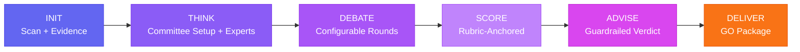

<p align="center">
  
  
  
  
  
</p>

<h1 align="center">Gang</h1>
<h3 align="center">Configurable Multi-Agent Business Committee for Claude Code</h3>

<p align="center">
  <strong>One command. Configurable experts. Evidence-backed verdict.</strong><br/>
  Turn your IDE into a boardroom — configure which experts analyze, how they debate, what budget they use,<br/>
  and get a rubric-anchored Go/No-Go recommendation with full audit trail.
</p>

<p align="center">
  <code>/gang run</code>
</p>

---

## What's New in v1.3.0

| Feature | Description |
|---------|-------------|
| **Role Controls** | Enable/disable agents, set weight (light/deep), model (haiku/sonnet/opus), timeout |
| **Selective Debate** | 4 debate modes: all-vs-all, selective pairs, relevance-based, focused topics |
| **Output Organization** | Save evaluations by feature or project in organized folders |
| **Cost Management** | Token estimation, budget limits, warnings, auto-blocking |
| **Adaptive Model Routing** | Budget-adaptive downgrade (opus->sonnet->haiku) + multi-provider (Perplexity, Gemini, Copilot) |
| **Evidence Ledger** | Codebase scan + web research populate evidence.json; agents must cite evidence_ids |
| **Assumptions Ledger** | Agents register unstated hypotheses with validation plans |
| **Scoring Rubrics** | Rubric-anchored scores (1-10 with textual descriptions per level) |
| **Advisor Guardrails** | CEO/CTO can't issue GO without rubric-anchored scores; auto-CONDITIONAL-GO on unvalidated assumptions |
| **Validation Layer** | Schema validation, cross-reference checks, between-stage validation, CI integration |
| **Quality Mode Presets** | Quick Scout ($~1) / Product Review ($~5) / Investment Grade ($~20) |

---

## Quick Start

```bash
# 1. Install the plugin
claude plugin install https://github.com/ebnrdwan/GangPlugin

# 2. Run on any project
/gang run
```

---

## How It Works



### Stage Pipeline

| Stage | What Happens |
|-------|-------------|
| **INIT** | Deep project scan, evidence population (codebase + web research), competitive research, quality mode selection |
| **THINK** | Committee setup question (every time), parallel expert dispatch with evidence/assumptions protocol |
| **DEBATE** | Configurable debate mode (4 options), evidence-cited critiques, 1-2 rounds |
| **SCORE** | Rubric-anchored scoring with evidence linking, weighted averages, confidence levels |
| **ADVISE** | CEO/CTO advisory with guardrails — auto-conditional on unvalidated assumptions |
| **DELIVER** | BRD, technical architecture, project charter, risk register, data model, API contracts |

### Status Display (v1.3.0)

```
Gang Committee Status
━━━━━━━━━━━━━━━━━━━━━━━━
Session: gang-20260330-143022
Version: 1.3.0
Mode: product_review
Evaluation: feature — stock-details-page

Committee (5 active):
  [on]  PM Lead ............. deep (sonnet)
  [on]  Market Researcher ... deep (perplexity-sonar-pro)
  [off] UX Researcher ....... disabled
  [on]  Finance Analyst ..... deep (gemini-2.5-pro)
  [on]  Solutions Architect . deep (sonnet)
  [off] Business Strategist . disabled
  [off] Domain Expert ....... disabled
  [on]  CEO/CTO Advisor ..... deep (opus)

Debate: selective · 2 rounds
Evidence: 14 entries · 8 assumptions tracked
Validation: strict (passing)

[done] INIT ........... $0.12  validated
[done] THINK .......... $1.23  validated (5/5 agents, 0 failures)
[ -> ] DEBATE ......... in progress
[    ] SCORE
[    ] ADVISE
[    ] DELIVER

Cost: ~$1.35 / $5.00 budget (27%)

Next: Run /gang debate to continue
```

---

## Commands

| Command | Description |
|---------|-------------|
| `/gang run` | Run full pipeline end-to-end |
| `/gang init` | Initialize workspace, select quality mode, scan project, populate evidence |
| `/gang think` | Committee setup + parallel expert analysis |
| `/gang debate` | Configurable cross-review debate |
| `/gang score` | Rubric-anchored plan synthesis and scoring |
| `/gang advise` | CEO/CTO advisory with guardrails |
| `/gang deliver` | Generate GO Package (requires GO/CONDITIONAL-GO) |
| `/gang reinit` | Re-run INIT, refresh context, reset downstream |
| `/gang status` | Show progress, committee, cost, validation |
| `/gang config` | Show/edit configuration |
| `/gang evaluations` | List all feature and project evaluations |
| `/gang validate` | Run validation checks |

---

## The Committee

| Expert | Focus | Model |
|--------|-------|-------|
| **PM Lead** | RICE, MVP scope, requirements | Configurable |
| **Market Researcher** | TAM/SAM/SOM, competitive analysis, SWOT | Configurable (Perplexity option) |
| **UX Researcher** | Personas, journeys, design tokens, Stitch specs | Configurable |
| **Finance/Risk Analyst** | DCF, SaaS metrics, risk matrix, scenarios | Configurable (Gemini option) |
| **Solutions Architect** | Feasibility, architecture, build-vs-buy TCO | Configurable (Copilot option) |
| **Business Strategist** | GTM, business model, competitive moat | Configurable (Gemini option) |
| **Domain Expert** *(optional)* | Industry SME — regulatory, benchmarks, domain risks | Configurable |
| **CEO/CTO Advisor** | Go/No-Go verdict, kill switches, roadmap | Opus (always last to downgrade) |
| **Deliverables Writer** | BRD, architecture, charter, risk register, data model, API contracts | Configurable |

---

## Quality Mode Presets

| Mode | Agents | Weight | Budget | Debate | Best For |
|------|--------|--------|--------|--------|----------|
| **Quick Scout** | 3 (PM, Architect, CEO) | Light | ~$1 | Focused, 1 round | Early filtering |
| **Product Review** | 5 core + CEO | Deep | ~$5 | Selective, 2 rounds | Feature evaluation |
| **Investment Grade** | All 7+ | Deep | ~$20 | Relevance-based, 2 rounds | Major decisions |
| **Custom** | You choose | You choose | You set | You configure | Full control |

---

## Configuration

All settings live in `.gang/config.yaml`. Edit between stages — changes take effect on the next stage run.

Key configuration areas:
- **Roles** — enable/disable agents, set weight (light/deep), model, timeout
- **Debate** — mode (4 options), max rounds, selective pairs, focused topics
- **Cost** — budget limit, warning/blocking thresholds, model rates
- **Routing** — manual, budget-adaptive, or multi-provider with external APIs
- **Evidence** — enable/disable evidence linking, web research provider, fallback chain
- **Scoring** — rubric anchoring, evidence linking, advisor guardrails
- **Validation** — strict/relaxed, between-stage checks, reference validation
- **Failure Handling** — retry, fallback, partial failure degradation

---

## Evidence & Assumptions

Every claim in the evaluation is either:
- **Evidence-backed** — cited from `evidence.json` with confidence scores
- **Assumption-flagged** — registered in `assumptions.json` with validation plans

The CEO/CTO Advisor cannot issue unconditional GO if critical assumptions are unvalidated. This is enforced by advisor guardrails, not just guidelines.

---

## Full Documentation

See **[gang/README.md](gang/README.md)** for complete documentation of all 11 features, configuration reference, and architecture details.

---

## License

MIT — use it, fork it, build on it.
