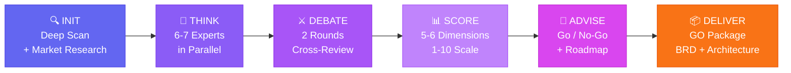
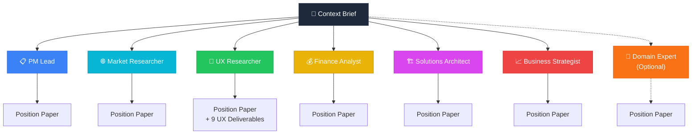
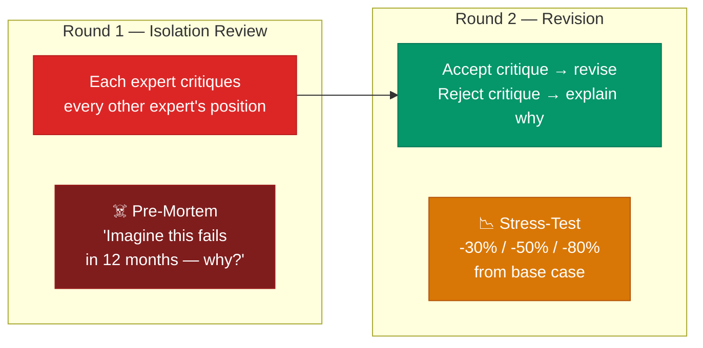

<p align="center">
  
  
  
  
  
  
</p>

<h1 align="center">Gang — Configurable Multi-Agent Business Committee</h1>

<p align="center">
  <strong>One command. Configurable experts. Evidence-backed verdict.</strong><br/>
  Gang turns Claude Code into a boardroom — configurable experts analyze your product idea with evidence-backed claims,<br/>
  debate positions with rubric-anchored scoring, and a CEO/CTO advisor delivers a guardrailed Go/No-Go recommendation.
</p>

<p align="center">
  <code>/gang run</code>
</p>

---

## v1.3.0 — What's New

11 features making the committee fully configurable, auditable, and cost-aware:

| # | Feature | What It Does |
|---|---------|-------------|
| 1 | [Role Controls](#1-role-controls) | Enable/disable agents, set weight (light/deep), model, timeout |
| 2 | [Selective Debate](#2-selective-debate-modes) | 4 debate modes controlling who reviews whom |
| 3 | [Output Organization](#3-output-organization) | Feature/project folders instead of flat output |
| 4 | [Cost Management](#4-cost-management--budget-tracking) | Token estimation, budget limits, per-stage tracking |
| 5 | [Adaptive Model Routing](#5-adaptive-model-routing) | Auto-downgrade models when approaching budget |
| 6 | [Multi-Provider Routing](#6-multi-provider-routing) | Route agents to Perplexity, Gemini, GitHub Copilot |
| 7 | [Evidence & Assumptions](#7-evidence--assumptions-protocol) | Evidence ledger with citation requirements |
| 8 | [Scoring Rubrics](#8-scoring-rubrics) | Rubric-anchored scoring with textual level descriptions |
| 9 | [Advisor Guardrails](#9-advisor-guardrails) | Conditions that block or downgrade GO verdicts |
| 10 | [Validation Layer](#10-validation-layer) | Schema checks, cross-references, CI integration |
| 11 | [Quality Mode Presets](#11-quality-mode-presets) | Quick Scout / Product Review / Investment Grade |

> Full details for each feature are documented in the [v1.3.0 Configuration Guide](#v130-configuration-guide) section below.

---

## 🚨 The Gap

Today's AI-assisted development is great at **building** — but terrible at deciding **what to build and why**.

| | What Exists Today | What's Missing |
|---|---|---|
| 🤖 | AI coding assistants that generate code fast | No structured framework to evaluate whether the code *should* be written |
| 💬 | Single-perspective AI advice ("here's what I think") | Multi-perspective adversarial analysis that stress-tests assumptions |
| 🧩 | Product strategy tools across 5 different SaaS platforms | One command that scans your codebase, researches competitors, and delivers a complete analysis |
| 🎲 | Go/No-Go decisions made on gut feel in Slack threads | Quantified scoring across market viability, feasibility, finance, UX, and strategy — with kill switches |
| 🎨 | Design tools disconnected from business strategy | UX deliverables (personas, journeys, design tokens) that flow directly into Google Stitch |
| 🔍 | Competitive analysis as a separate manual research task | Automated competitive scan built into the evaluation pipeline |

> 💡 **The core problem:** Engineers ship features nobody asked for. Founders chase markets that don't exist. Teams build before validating.
> **The cost isn't the code — it's the months spent building the wrong thing.**

**Gang closes this gap** by embedding a structured business evaluation pipeline directly in your development environment — where the decisions actually happen.

---

## 🔄 How It Works



Run `/gang status` at any point to see exactly where you are:

```
Gang Committee Status
━━━━━━━━━━━━━━━━━━━━━━━━
Session: gang-20260330-143022
Version: 1.3.0
Mode: product_review
Evaluation: feature — stock-details-page

Committee (5 active):
  [on]  PM Lead ............. deep (sonnet)
  [on]  Market Researcher ... deep (perplexity-sonar-pro)
  [off] UX Researcher ....... disabled
  [on]  Finance Analyst ..... deep (gemini-2.5-pro)
  [on]  Solutions Architect . deep (sonnet)
  [off] Business Strategist . disabled
  [off] Domain Expert ....... disabled
  [on]  CEO/CTO Advisor ..... deep (opus)

Debate: selective · 2 rounds
Evidence: 14 entries · 8 assumptions tracked
Validation: strict (passing)

[done] INIT ........... $0.12  validated
[done] THINK .......... $1.23  validated (5/5 agents, 0 failures)
[ -> ] DEBATE ......... in progress
[    ] SCORE
[    ] ADVISE
[    ] DELIVER

Cost: ~$1.35 / $5.00 budget (27%)

Next: Run /gang debate to continue
```

---

### 🔍 Stage 1 — INIT: Understand Everything First

Gang doesn't start with generic questions. It starts by **understanding your project deeply**:

| Step | What Happens |
|------|-------------|
| 1️⃣ **Deep codebase scan** | Tech stack, features, architecture, domain model, auth flows, monetization signals, data sources |
| 2️⃣ **Present understanding** | Shows what it found and asks you to confirm — *"Does this look right?"* |
| 3️⃣ **Competitive research** | Finds 5-8 competitors via web search, analyzes pricing, features, market gaps |
| 4️⃣ **Targeted questions** | Only asks what it couldn't determine — questions reference YOUR project and YOUR competitors by name |

<details>
<summary>💡 <strong>Example: Feature-level evaluation</strong></summary>

```
/gang init

I need to build a stock details page including prices, technical analysis,
fundamental analysis, news, signals (intraday/swing), calendar, predictions,
buy zones — and if I'm holding a position it should be marked.

Design reference: web application/stitch/projects/6261359687710202709/screens/...
```

Gang will scan your codebase, find that it's a stock analysis app, research TradingView/TrendSpider/Trade Ideas as competitors, and then ask smart questions like:

> *"Your codebase shows a SaaS subscription model — should the committee evaluate premium tier features for this page?"*

</details>

<details>
<summary>📋 <strong>Example: What INIT output looks like</strong></summary>

```
📋 Project Understanding
━━━━━━━━━━━━━━━━━━━━━━━
Product: StockInsight
Type: Web Application (Next.js + Spring Boot)
Stack: TypeScript, Kotlin, PostgreSQL, Redis, TradingView Widgets
Domain: Stock analysis platform for retail traders

Features Found:
  • Real-time price streaming via WebSocket
  • Watchlist management with alerts
  • Portfolio tracking with P&L calculation
  • News aggregation from multiple feeds
  • Basic charting with TradingView integration

Evaluation Subject: Stock Details Page
  Build a comprehensive stock details page including prices,
  technical analysis, fundamental analysis, news, signals
  (intraday/swing), calendar, predictions, and buy zones.
  Position markers for held stocks.

🌐 Competitive Scan
━━━━━━━━━━━━━━━━━━
Found 6 competitors:
  1. TradingView ........... Freemium · $14.95-59.95/mo · Most features
  2. TrendSpider ........... SaaS · $22-67/mo · AI-powered analysis
  3. Trade Ideas ........... SaaS · $118-228/mo · Scanning + signals
  4. Finviz ................ Freemium · $39.50/mo · Screening focus
  5. Stock Analysis ........ Freemium · $9.99/mo · Fundamental focus
  6. Seeking Alpha ......... Freemium · $19.99/mo · Community + news

Table-stakes: Real-time quotes, charting, watchlists, news
Gaps: Unified TA+FA on one page, position-aware signals, buy zone overlays

Does this look right? Anything I'm missing?
```

</details>

---

### 🧠 Stage 2 — THINK: Six (or Seven) Experts, Zero Groupthink

Six core experts (plus an optional Domain Expert) analyze independently and in parallel — **no agent sees another's work** (prevents anchoring bias):



| Expert | Default Model | Multi-Provider Option | What They Produce |
|--------|---------------|----------------------|-------------------|
| **PM Lead** | Sonnet | — | Scope definition, RICE prioritization, MoSCoW requirements, MVP boundary, PRD |
| **Market Researcher** | Sonnet | Perplexity sonar-pro | TAM/SAM/SOM sizing, competitive scoring, Porter's Five Forces, SWOT, battle cards |
| **UX Researcher** | Sonnet | — | Personas, JTBD, journey maps, wireframes, design tokens, **Google Stitch instructions** |
| **Finance/Risk Analyst** | Sonnet | Gemini 2.5 Pro | DCF valuation, SaaS metrics, risk matrix, scenario modeling (base/bull/bear/stress) |
| **Solutions Architect** | Sonnet | GitHub Copilot (GPT-4o) | Feasibility scoring, architecture, tech stack, build-vs-buy TCO, ADRs |
| **Business Strategist** | Sonnet | Gemini 2.5 Pro | Business Model Canvas, GTM strategy, competitive moat, pricing tiers |
| **Domain Expert** *(optional)* | Sonnet | — | Industry SME — regulatory landscape, domain benchmarks, table-stakes vs differentiators |

All agents run in **a single parallel dispatch** — you see results as each expert finishes:

<details>
<summary>📋 <strong>Real output: PM Lead on a stock details page</strong></summary>

> **Bottom Line:** Ship 6 sections of the Stock Details Page in 5 weeks. Defer XGBoost Price Outlook and Market Regime Badge because the ML bugs are unresolved — broken predictions are worse than absent ones.
>
> **Key decisions:**
> 1. **MVP vs v2 split.** Six sections in v1 (Header, Chart, Indicators, Patterns, Position Banner, Intelligence Stream), four deferred. The RICE scores expose the real finding: 5 of the 6 v1 sections have zero new backend work required.
> 2. **Critical path finding.** Build Indicators + Patterns + News + Header first (all unblocked today), then add the chart once the OHLCV endpoint is done. The page ships value before the chart lands.
> 3. **Free vs Premium gating.** AI recommendation badge and confidence percentage are the Pro paywall anchor. Basic chart and indicators are free — gating standard indicators drives users to TradingView.
> 4. **ML section deferred with clear re-entry condition.** XGBoost Price Outlook deferred until backtested accuracy exceeds 60% on a 90-day holdout. No feature flag shipped without that gate.

</details>

<details>
<summary>🌐 <strong>Real output: Market Researcher competitive scoring</strong></summary>

> **Market Sizing:**
> - Bottom-up TAM: $1.35B (3M paying retail traders x $450/yr average spend). The context brief's $8B figure conflates raw data licensing with the pure SaaS tools layer.
> - SAM: $840M–$1.26B. SOM Year 1: $600K–$3M ARR at 1,000–5,000 users.
>
> **Competitive Scores (weighted):**
> - TradingView: 4.35/5 · TOS: 3.75/5 · Trade Ideas: 3.35/5 · TrendSpider: 3.15/5 · StockInsight now: 2.55/5
> - TOS (thinkorswim, free with Schwab) is underrated in the brief — it is a significant free substitute on the stock detail surface.
>
> **Biggest Risk Flagged:** The yfinance redistribution legal status is the highest-risk unresolved supplier issue — if exchange agreements prohibit redistribution to paying users, the fundamentals section requires a paid data provider, compressing margins.

</details>

<details>
<summary>🏗️ <strong>Real output: Solutions Architect code-level findings</strong></summary>

> **Feasibility: 7/10.** The Stock Details Page is buildable in 6 weeks for a solo founder — but only with deliberate scope cuts.
>
> **What the code review revealed:**
> - `TradingChart.tsx` is fully built with proper dark theme and volume histogram. It is just not wired up — there is a placeholder div on the page where it should render. This is a half-day fix, not a multi-week build.
> - `MarketDataProvider` is well-designed with a proper ABC. `get_historical()` already exists on `YahooProvider`. The OHLCV endpoint is purely a serialization exercise.
> - Symbol is stored in component state, not the URL. This is a 20-minute fix that unblocks bookmarking and sharing — it should be the first commit.
>
> **The "STRONG BUY 94%" header badge is a lie.** The current `_derive_signal()` produces a ratio of bullish indicators to total factors. It is not a calibrated probability. Labeling it "94% confidence" would mislead traders and create SEC/FINRA surface area. Ship it as "Signal Confidence" with the honest computed value.

</details>

<details>
<summary>💰 <strong>Real output: Finance Analyst risk escalation</strong></summary>

> **Data Licensing — promoted to Risk Score 20 (was 8).** Serving scraped Yahoo Finance data to paying users almost certainly violates Yahoo's ToS and exchange redistribution agreements. The fix costs $29/mo (Polygon.io Basic). This must be resolved before the first paid user signs up.
>
> **ROI Per Section:** The Candlestick Chart, Technical Patterns, Intelligence Stream, and Position Banner are the highest-ROI sections — they drive daily return habits and differentiate from free tools without requiring ML model fixes.
>
> **Kill Switches (7 specific conditions):** Binary, time-bound financial triggers with prescribed actions — not general cautions.
>
> **Stress test conclusion:** At -50% revenue the business remains cash-flow positive (cash costs are only $1,074/mo). The real stress failure is founder motivation after 12 months at below-market compensation — a key-person risk, not a solvency risk.

</details>

<details>
<summary>📈 <strong>Real output: Business Strategist conversion funnel</strong></summary>

> **Core Strategic Argument:** The Stock Details Page is a three-job machine: **acquire** (free, indexable, shareable), **tease** (visible but locked), **retain** (sticky Pro features). The conversion funnel runs top-to-bottom on the page — every section has an assigned role.
>
> **Pricing tiers:**
> - Free: 1D chart, full technical indicators, 3 news items, price header
> - Starter ($29/mo): All timeframes, patterns, earnings, regime badge, fundamentals
> - Pro ($49/mo): AI Recommendation badge, XGBoost Outlook, Signal History, Position Banner
>
> The AI Recommendation badge as a blurred teaser in the page header is the single highest-ROI conversion trigger. It is visible on every page load, requires no ML work to implement as a teaser, and creates an immediate upgrade moment.
>
> **Critical Risk:** The ML accuracy problem is a load-bearing assumption under the entire Pro pricing tier. Do not gate revenue on broken features — launch Pro with rule-based signals labeled honestly. Shipping broken AI signals as a paid feature is a trust-destroying event that no marketing recovers from.

</details>

> 💡 **Notice how experts independently converged** on the same risks (yfinance licensing, ML accuracy) and the same recommendation (defer ML, ship rule-based signals first) — without seeing each other's work. This is the power of role-isolated parallel analysis.

---

### ⚔️ Stage 3 — DEBATE: Structured Adversarial Review

Two rounds of structured cross-review using the **Board Meeting protocol** + **Executive Mentor adversarial patterns**:



- ⚔️ **Round 1 — Isolation:** Each expert critiques every other position. Executive Mentor runs a pre-mortem: *"Imagine this fails in 12 months — why?"*
- 🔄 **Round 2 — Revision:** Each expert addresses critiques — accept with revision or reject with reasoning. Unresolved conflicts are logged.
- 📉 **Stress-test:** Downside scenarios modeled at **-30%**, **-50%**, **-80%** from base case.

---

### 📊 Stage 4 — SCORE: Quantified Decision Framework

1-2 competing plans scored on **5-6 dimensions** (1-10 scale + confidence %). A 6th dimension "Domain Fit" is added when the Domain Expert is enabled:

| Dimension | What It Measures | Scored By |
|-----------|-----------------|-----------|
| 🌐 **Market Viability** | Is there a real, reachable market? | Market Researcher + Business Strategist |
| 🎯 **User Desirability** | Do users want this? Does it solve their pain? | UX Researcher + PM Lead |
| ⚙️ **Technical Feasibility** | Can we build it in the proposed timeline? | Solutions Architect |
| 💰 **Financial Viability** | Does the math work? Is ROI acceptable? | Finance/Risk Analyst |
| 🧭 **Strategic Alignment** | Is it defensible? Does it fit our direction? | Business Strategist + PM Lead |
| 🔬 **Domain Fit** *(optional)* | Does it respect industry realities? | Domain Expert |

<details>
<summary>📋 <strong>Example score output</strong></summary>

```
┌─────────────────────┬───────┬────────────┬──────────────────────────────────┐
│ Dimension           │ Score │ Confidence │ Key Evidence                     │
├─────────────────────┼───────┼────────────┼──────────────────────────────────┤
│ 🌐 Market Viability │  8    │  85%       │ $4.2B TAM, growing 18% YoY      │
│ 🎯 User Desirability│  7    │  75%       │ Strong JTBD fit, 3 pain points  │
│ ⚙️ Tech Feasibility │  9    │  90%       │ Existing stack supports it       │
│ 💰 Financial Viab.  │  6    │  70%       │ Break-even at 14 months          │
│ 🧭 Strategic Align. │  8    │  80%       │ Strengthens moat in core market  │
├─────────────────────┼───────┼────────────┼──────────────────────────────────┤
│ ⭐ Weighted Average │  7.6  │  80%       │                                  │
└─────────────────────┴───────┴────────────┴──────────────────────────────────┘
```

</details>

---

### 👔 Stage 5 — ADVISE: Executive Verdict (Opus)

The CEO/CTO Advisor (running on **Opus** for deepest reasoning) reads everything and produces a **comprehensive executive brief**:

| Section | Content |
|---------|---------|
| ✅ / ❌ / ⚠️ | **Go / No-Go / Conditional-Go** verdict |
| 🗺️ | Strategic options matrix with Tree of Thought analysis |
| 💵 | Capital allocation across 4 tiers |
| 🚨 | **Kill switches** — decision checkpoints to exit early if assumptions break |
| 📉 | Downside scenarios with stress-test results |
| 📅 | **90-day implementation roadmap** |
| ⚡ | **Quick wins** to execute immediately |

<details>
<summary>👔 <strong>Example: Executive brief summary</strong></summary>

```
👔 Executive Brief — CEO/CTO Advisory
━━━━━━━━━━━━━━━━━━━━━━━━━━━━━━━━━━━━━

  Verdict:  ✅ CONDITIONAL GO

  "Build the stock details page, but phase the rollout.
   Ship core (price + TA + FA) in 6 weeks, then layer signals
   and predictions behind a premium gate to validate willingness
   to pay before investing in ML infrastructure."

📊 Plan A Score: 7.6 / 10  (80% confidence)

🚨 Kill Switches:
  1. If <2% of free users click "Upgrade" prompt by Week 8 → cut ML scope
  2. If data provider costs exceed $3K/mo at 1K DAU → renegotiate or switch
  3. If TA page load >3s on P95 → simplify before adding more widgets

⚡ Quick Wins (Week 1-2):
  • Integrate TradingView advanced chart on detail page
  • Add position badge overlay (portfolio API exists)
  • Wire up existing news feed to stock-specific filter

📅 90-Day Roadmap:
  Week 1-2:   Core page layout + price + basic chart
  Week 3-4:   Technical analysis widgets + fundamental data cards
  Week 5-6:   News integration + calendar + earnings
  Week 7-8:   Signals MVP (rules-based, not ML) + premium gate
  Week 9-12:  Prediction engine v1 + buy zone overlays (if gate validates)

📉 Downside Scenarios:
  Base:   $4.2K MRR by Month 6 (12% conversion on premium)
  Bear:   $1.8K MRR (5% conversion — signals not compelling enough)
  Stress: $0.4K MRR (2% conversion — pivot to pure free + ads)
```

</details>

---

### 📦 Stage 6 — DELIVER: GO Package

When the verdict is **GO** or **CONDITIONAL-GO**, run `/gang deliver` to generate a complete set of build-ready documents from all committee artifacts:

```
.gang/go-package/
├── brd.md                       # Business Requirements Document
│                                  Objectives, stakeholder analysis, MoSCoW requirements,
│                                  functional + non-functional requirements, user stories,
│                                  business rules, data requirements, constraints
│
├── technical-architecture.md   # Technical Architecture Specification
│                                  System overview, ADRs, C4 diagrams, tech stack,
│                                  data + integration + security architecture,
│                                  scalability design, monitoring
│
├── project-charter.md           # Project Charter
│                                  Purpose, objectives, scope, phased milestones,
│                                  budget summary, stakeholders, kill switches,
│                                  success criteria
│
├── risk-register.md             # Formal Risk Register
│                                  Risk ID, category, likelihood × impact scoring,
│                                  owner, mitigation, contingency, kill switch mapping
│
├── data-model.md                # Domain Model / ER Specification
│                                  Entity definitions, relationships, data lifecycle,
│                                  PII annotations, compliance constraints
│
└── api-contracts.md             # API Contract Drafts
                                   Endpoints, request/response schemas, auth requirements,
                                   rate limits, error formats, versioning strategy
```

> 💡 **If verdict is NO-GO:** `/gang deliver` will explain why it can't generate the GO Package and what needs to change to reach a GO verdict.

---

### 🔄 `/gang reinit` — Refresh Without Losing Progress

Projects evolve. Code changes. Market moves. Run `/gang reinit` to re-run the INIT stage on an existing session without starting over:

| What changes | What's preserved |
|-------------|-----------------|
| Deep codebase re-scan (picks up new code) | Session ID — same evaluation thread |
| Fresh competitive research | `.gang/learnings/` (accumulated insights) |
| Re-asked scoping questions (existing answers shown as defaults) | Option to accept or update each answer |
| Reset: THINK/DEBATE/SCORE/ADVISE stages must re-run | Domain expert opt-in can be changed |

```bash
/gang reinit    # Re-run INIT, refresh context brief, reset downstream stages
```

State after `reinit`:
```json
{
  "session_id": "gang-20260329-143022",  // unchanged
  "stages_completed": ["init"],           // downstream reset
  "reinit_count": 1,                      // tracks refreshes
  "last_reinit": "2026-03-29T16:00:00Z"
}
```

---

## 🎯 Use Cases

### 1. 💡 "Should we build this?" — Full Product Evaluation

You have a product idea or an existing codebase. Is it worth pursuing?

```bash
/gang run
```

Gang scans your project, researches the market, runs all 6 stages, and delivers a complete evaluation with a Go/No-Go verdict.

---

### 2. 🧩 Feature-Level Evaluation

Evaluating a specific feature or page, not the whole product.

```
/gang init

I need to build a stock details page with prices, technical analysis,
fundamental analysis, news, signals, calendar, predictions, buy zones.
If I hold a position, it should be marked.
```

> The Market Researcher analyzes competitors' stock detail pages, the UX Researcher produces wireframes and Stitch instructions, the Architect evaluates data source integration.

---

### 3. 🔀 Pivot or Stay — Strategic Decision

Growth is stalling. Should you pivot, double down, or expand?

```
/gang init

We have 2,000 MAU on our project management tool targeting freelancers.
Growth flatlined 3 months ago. Should we pivot to small teams,
add AI features, or find a different acquisition channel?
```

> The committee evaluates each option, debates trade-offs, and the CEO/CTO advisor recommends the highest-EV path with clear kill switches.

---

### 4. 💵 Monetization Strategy

Users but no revenue. How should you charge?

```
/gang init

We have a developer documentation tool with 15K weekly active users.
Currently free. Need to figure out pricing without killing growth.
```

> Finance Analyst benchmarks SaaS metrics, Business Strategist models pricing tiers, Market Researcher analyzes competitor pricing, PM Lead defines free vs. paid.

---

### 5. 🏦 Pre-Fundraise Due Diligence

Simulate the tough questions investors will ask.

```
/gang init

We're raising a seed round in Q3 for our AI-powered compliance
tool for fintech startups. Need to stress-test our pitch.
```

> The committee acts like a skeptical investment committee — stress-testing market size, unit economics, technical moat, and competitive positioning. The executive brief becomes your prep document.

---

### 6. 🥊 Competitive Repositioning

A competitor just launched or an incumbent moved into your space.

```
/gang init

Stripe just launched a feature that overlaps with our core product.
How should we respond — differentiate, go upmarket, niche down, or pivot?
```

> Market Researcher does a deep competitive teardown, the Strategist evaluates positioning options, and the committee debates the best response.

---

## v1.3.0 Configuration Guide

All configuration lives in `.gang/config.yaml`, created during `/gang init` based on your chosen quality mode. You can edit it at any time — changes take effect on the next stage run. View it with `/gang config`.

The complete default config is at `gang/skills/gang/references/default-config.yaml` in the plugin source.

---

### 1. Role Controls

Every agent has four configurable properties:

```yaml
roles:
  gang-pm-lead:
    enabled: true        # true = active, false = skipped entirely
    weight: deep         # "light" or "deep"
    model: sonnet        # "haiku", "sonnet", or "opus"
    timeout: 120         # seconds (0 = no limit)
```

**All 9 agents and their defaults:**

| Agent | Default Enabled | Default Weight | Default Model | Default Timeout |
|-------|:-:|:-:|:-:|:-:|
| `gang-pm-lead` | yes | deep | sonnet | 120s |
| `gang-market-researcher` | yes | deep | sonnet | 150s |
| `gang-ux-researcher` | yes | deep | sonnet | 180s |
| `gang-finance-risk-analyst` | yes | deep | sonnet | 120s |
| `gang-solutions-architect` | yes | deep | sonnet | 120s |
| `gang-business-strategist` | yes | deep | sonnet | 120s |
| `gang-domain-expert` | no | deep | sonnet | 120s |
| `gang-ceo-cto-advisor` | **always** | deep | **opus** | 300s |
| `gang-deliverables-writer` | **always** | deep | sonnet | 300s |

**Special rules:**
- `gang-ceo-cto-advisor` **cannot be disabled** — it is the synthesizer that produces the final verdict.
- `gang-deliverables-writer` is always enabled when DELIVER runs (it generates the GO Package).
- `gang-domain-expert` is off by default. During INIT, Gang asks: "Include a Domain Expert?" If yes, it generates a domain-specific persona profile.

#### Weight Modes

| Weight | Word Limit | Behavior |
|--------|:----------:|----------|
| `light` | ~500 words | Bottom line in 2 sentences, top 3 findings with evidence, key risk. Skips detailed frameworks (RICE tables, DCF models, journey maps, etc.). Best for fast directional reads. |
| `deep` | ~1500+ words | Full analysis using all domain frameworks. Tables, models, and detailed breakdowns included. Default for thorough evaluations. |

Each agent has specific skip lists in light mode. For example:
- **PM Lead (light):** Skips RICE tables, MoSCoW classification, full success metrics. Keeps MVP boundary + top 3 features.
- **Market Researcher (light):** Skips 12-dimension scoring, Porter's Five Forces, battle cards, positioning maps. Keeps TAM/SAM/SOM + top 3 competitors.
- **Finance Analyst (light):** Skips DCF models, full SaaS benchmarking, 4-scenario stress tests. Keeps unit economics + break-even + top risk.
- **Solutions Architect (light):** Skips C4 diagrams, ADRs, tech debt matrices, DORA metrics. Keeps feasibility score + critical path + top blocker.
- **UX Researcher (light):** Produces position paper only — skips the 9 UX deliverable files (personas, journey maps, design tokens, Stitch instructions, etc.).

#### Committee Setup at THINK

Every time you run `/gang think`, Gang asks a committee setup question:

- **If a previous setup exists:** "Keep current setup" | "Full committee" | "Lean committee" | "Custom"
- **If no previous setup:** "Full (default)" | "Lean" | "Custom"

This means you can adjust the committee between runs without editing config.yaml manually. "Custom" lets you toggle each agent individually and set their weights.

---

### 2. Selective Debate Modes

The debate stage supports 4 modes, controlled by `config.debate.mode`:

```yaml
debate:
  enabled: true              # false = skip debate entirely
  mode: all-vs-all           # "all-vs-all" | "selective" | "relevance-based" | "focused"
  max_rounds: 2              # 1 = critique only, 2 = critique + revision
  selective_pairs: {}         # only used when mode = selective
  focused_topics: []          # only used when mode = focused
  round2_mode: all-vs-all    # FIXED — cannot be changed
```

#### Mode 1: All-vs-All (default)

Every enabled agent reviews every other agent's position paper. Maximum coverage but highest cost. Best for investment-grade evaluations.

#### Mode 2: Selective

You define exactly which agents review which other agents:

```yaml
debate:
  mode: selective
  selective_pairs:
    gang-pm-lead: [gang-market-researcher, gang-ux-researcher]
    gang-finance-risk-analyst: [gang-solutions-architect, gang-business-strategist]
    gang-market-researcher: [gang-pm-lead, gang-business-strategist]
```

Agents not listed as reviewers still **get reviewed** if they appear as a target. They just don't write critiques of others. This is the default for `product_review` mode — it focuses debate on the most relevant cross-domain interactions.

#### Mode 3: Relevance-Based

Auto-determined pairs based on domain overlap. No configuration needed — the orchestrator uses this mapping:

| Agent | Reviews |
|-------|---------|
| PM Lead | Market Researcher, UX Researcher |
| Market Researcher | PM Lead, Business Strategist |
| UX Researcher | PM Lead, Solutions Architect |
| Finance Analyst | Solutions Architect, Business Strategist |
| Solutions Architect | Finance Analyst, PM Lead |
| Business Strategist | Market Researcher, Finance Analyst |
| Domain Expert (if enabled) | **ALL agents** (domain expertise applies everywhere) |

This is the default for `investment_grade` mode.

#### Mode 4: Focused

All agents debate only the topics you specify:

```yaml
debate:
  mode: focused
  focused_topics:
    - "Is the pricing model sustainable?"
    - "Can we achieve product-market fit without enterprise sales?"
    - "Is the technical architecture scalable to 100K users?"
```

Each agent addresses these questions from their domain perspective and critiques other agents' answers. This is useful when you already know the key tensions and want the committee to resolve them specifically.

#### Round 2 Is Always All-vs-All

Regardless of which Round 1 mode you choose, Round 2 (revision) is always `all-vs-all`. Every agent that received critiques **must** respond — accept with revision or reject with reasoning. This ensures no critique goes unanswered.

If `max_rounds: 1`, only Round 1 runs (critique without revision). This is faster and cheaper but means positions are never revised in response to feedback.

---

### 3. Output Organization

During INIT, Gang asks: "What are we evaluating?" You choose:

| Type | Path | When to Use |
|------|------|-------------|
| **Feature** | `.gang/features/{name}/` | Evaluating a specific feature (e.g., `stock-details-page`) |
| **Project** | `.gang/projects/{name}/` | Evaluating an entire product or project (e.g., `mobile-app`) |
| **Flat** | `.gang/` | Quick one-off evaluation, no need for organization |

All internal paths use `{output_root}`, which resolves to the chosen location. The config file always lives at `.gang/config.yaml` (shared across evaluations).

**Listing evaluations:** Run `/gang evaluations` to see all evaluations:

```
Gang Evaluations
━━━━━━━━━━━━━━━━
Features:
  1. stock-details   Stage: complete  Verdict: CONDITIONAL-GO  2026-03-28
  2. portfolio-view   Stage: think     Verdict: —              2026-03-30

Projects:
  1. mobile-app      Stage: advise    Verdict: GO             2026-03-25

Flat: (none)
```

---

### 4. Cost Management & Budget Tracking

Gang estimates token usage and tracks costs per stage and per agent. This is critical for managing spend across evaluations.

```yaml
cost:
  enabled: true          # false = no cost tracking at all
  budget_limit: 0        # in USD. 0 = no limit (track but don't enforce)
  warn_at: 80            # percentage of budget to show a warning
  block_at: 100          # percentage of budget to block and ask confirmation
  model_rates:           # estimated cost per 1 million tokens
    haiku:   { input: 0.25,  output: 1.25  }
    sonnet:  { input: 3.00,  output: 15.00 }
    opus:    { input: 15.00, output: 75.00 }
    perplexity-sonar-pro: { input: 3.00,  output: 15.00 }
    gemini-2.5-pro:       { input: 1.25,  output: 10.00 }
    gpt-4o:               { input: 2.50,  output: 10.00 }
```

#### How Token Estimation Works

For each agent dispatch, Gang estimates:

1. **Input tokens** = (sum of all input file sizes in bytes / 4) + 500 (system prompt overhead)
   - Input files include: context brief, evidence.json, relevant position papers, debate reviews, etc.
   - The `/4` ratio approximates bytes-to-tokens for English text
   - The `+500` accounts for the system prompt and agent instructions
2. **Output tokens** = input tokens * 0.5 (typical generation ratio)
3. **Estimated cost** = (input_tokens / 1,000,000 * input_rate) + (output_tokens / 1,000,000 * output_rate)
4. Rates come from `config.cost.model_rates` for the agent's resolved model

**Example calculation** for a PM Lead agent reading a 12KB context brief, 8KB evidence.json, and running on Sonnet:
```
Input tokens  = (12,000 + 8,000) / 4 + 500 = 5,500 tokens
Output tokens = 5,500 * 0.5 = 2,750 tokens
Cost = (5,500 / 1M * $3.00) + (2,750 / 1M * $15.00)
     = $0.0165 + $0.04125
     = ~$0.058 per agent dispatch
```

#### Budget Thresholds

When `budget_limit > 0`, Gang checks before each stage:

| Budget % | What Happens |
|:--------:|-------------|
| < `warn_at` (80%) | Normal operation. Cost shown in status. |
| >= `warn_at` (80%) | **Warning:** "Budget at {X}% — consider switching to light mode or fewer agents" |
| >= `block_at` (100%) | **Block:** "Budget reached {X}%. Continue anyway? [yes/no]" |

You must explicitly confirm to proceed past the block threshold. This prevents accidental overspend.

#### Where Costs Are Tracked

All cost data is stored in `{output_root}/state.json`:

```json
{
  "cost": {
    "total_estimated_usd": 1.35,
    "stages": {
      "init": {
        "tokens_in": 4200,
        "tokens_out": 2100,
        "estimated_usd": 0.12
      },
      "think": {
        "tokens_in": 38000,
        "tokens_out": 19000,
        "estimated_usd": 1.23,
        "by_agent": {
          "gang-pm-lead": { "tokens_in": 6800, "tokens_out": 3400, "estimated_usd": 0.22, "model": "sonnet" },
          "gang-market-researcher": { "tokens_in": 7200, "tokens_out": 3600, "estimated_usd": 0.25, "model": "sonnet" }
        }
      }
    }
  }
}
```

Run `/gang status` to see a live cost summary at any point.

#### Typical Costs by Quality Mode

| Mode | Agents | Weight | Debate | Estimated Total |
|------|:------:|:------:|--------|:---------------:|
| Quick Scout | 3 | light | 1 round, focused | ~$0.50–$1.50 |
| Product Review | 5 | deep | 2 rounds, selective | ~$2.00–$5.00 |
| Investment Grade | 7-8 | deep | 2 rounds, relevance-based | ~$8.00–$20.00 |

Costs vary based on project size (more code = more evidence = larger input files), number of competitors found, and debate intensity.

---

### 5. Adaptive Model Routing

Model routing determines which AI model each agent uses. There are three modes:

```yaml
routing:
  mode: manual           # "manual" | "budget-adaptive" | "multi-provider"
```

#### Mode 1: Manual (default)

Each agent uses exactly the model specified in `config.roles.{agent}.model`. No automatic changes. You have full control.

#### Mode 2: Budget-Adaptive

Starts with configured models but **automatically downgrades** when approaching budget limits. To enable this, set `routing.mode: budget-adaptive` in `config.yaml` (the default is `manual`). This mode is automatically enabled by the `quick_scout` and `product_review` presets.

**How downgrade works:**

| Budget % | Action |
|:--------:|--------|
| 0–59% | All agents use their configured models. No changes. |
| 60–79% | **Opus agents downgrade to Sonnet** — except the top 3 in the priority list. |
| 80–99% | **Sonnet agents downgrade to Haiku** — except the top 2 in the priority list. |
| 100%+ | Block and ask (per `cost.block_at`). |

**Downgrade priority** (last entry downgrades first):

```yaml
routing:
  downgrade_priority:
    - gang-ceo-cto-advisor        # 1st — LAST to downgrade (always protected)
    - gang-deliverables-writer    # 2nd — protected until extreme budget pressure
    - gang-pm-lead                # 3rd — protected at 60%, downgrades at 80%
    - gang-solutions-architect    # 4th
    - gang-finance-risk-analyst   # 5th
    - gang-market-researcher      # 6th
    - gang-ux-researcher          # 7th
    - gang-business-strategist    # 8th
    - gang-domain-expert          # 9th — FIRST to downgrade
```

**Example scenario** with a $5 budget and CEO on Opus, others on Sonnet:

1. At $0 (start): All agents run as configured. No changes.
2. At $3.00 (60%): The CEO/CTO Advisor is the only Opus agent — it stays on Opus because it's #1 in priority. No Opus downgrades happen at this threshold because only 1 agent uses Opus and it's protected.
3. At $4.00 (80%): Sonnet agents start downgrading to Haiku, **starting from the bottom of the priority list**: Domain Expert → Business Strategist → UX Researcher → Market Researcher → Finance Analyst → Solutions Architect. The top 2 (CEO/CTO Advisor, Deliverables Writer) are protected. Gang shows: "Budget at 80% — downgrading gang-domain-expert from sonnet to haiku"
4. CEO/CTO Advisor stays on Opus until the very end — it's the most critical analysis.

**Why this matters:** An Opus dispatch costs ~60x more than a Haiku dispatch for the same input. Budget-adaptive routing lets you start with high-quality models and gracefully degrade rather than hitting a hard budget wall mid-evaluation.

#### Mode 3: Multi-Provider

Routes specific agents to external AI providers instead of Claude. See [Multi-Provider Routing](#6-multi-provider-routing) below.

**Note:** Budget-adaptive and multi-provider can work together. When `mode: multi-provider`, budget-adaptive downgrade rules still apply to agents that fall back to Claude models.

---

### 6. Multi-Provider Routing

In multi-provider mode, specific agents are routed to external AI providers that may have domain advantages:

```yaml
routing:
  mode: multi-provider
  external_providers:
    perplexity:
      enabled: false                    # toggle this provider
      api_key_env: PERPLEXITY_API_KEY   # env var containing the API key
      model: sonar-pro                  # model to use
      best_for: [gang-market-researcher]  # which agents route here
      fallback: haiku                   # Claude model if provider fails
    gemini:
      enabled: false
      api_key_env: GEMINI_API_KEY
      model: gemini-2.5-pro
      best_for: [gang-finance-risk-analyst, gang-business-strategist]
      fallback: haiku
    copilot:
      enabled: false
      api_key_env: GITHUB_TOKEN
      model: gpt-4o
      best_for: [gang-solutions-architect]
      fallback: haiku
```

#### How Multi-Provider Dispatch Works

For each agent, the orchestrator checks:

1. Is `routing.mode` set to `multi-provider`?
2. Is this agent listed in any provider's `best_for` array?
3. Is that provider `enabled: true`?
4. Is the API key environment variable set?

If all conditions are met:
1. Gang gathers all input files the agent needs (context brief, evidence, position papers, etc.)
2. Constructs the full agent prompt (identical to what a Claude agent would receive)
3. Writes the prompt to a temporary file
4. Calls: `bash {plugin_root}/scripts/external-dispatch.sh --provider {name} --model {model} --input {prompt_file} --output {output_file}`
5. Checks the exit code (see below)
6. On success: reads the output file and continues
7. On failure: falls back to the configured `fallback` Claude model

If any condition is not met, the agent runs on its configured Claude model as normal.

#### Provider Setup

**Perplexity (best for Market Researcher):**
- Perplexity sonar-pro has real-time web access, making it ideal for market research, competitor analysis, and trend data.
- Get an API key at [perplexity.ai](https://perplexity.ai)
- Set: `export PERPLEXITY_API_KEY=your-key-here`

**Gemini (best for Finance Analyst, Business Strategist):**
- Gemini 2.5 Pro has strong analytical capabilities with Google Search grounding.
- Get an API key at [ai.google.dev](https://ai.google.dev)
- Set: `export GEMINI_API_KEY=your-key-here`

**GitHub Copilot / GPT-4o (best for Solutions Architect):**
- Uses the GitHub Models inference endpoint.
- Uses your existing GitHub token.
- Set: `export GITHUB_TOKEN=your-token-here`

#### External Dispatch Exit Codes

The dispatch script (`gang/scripts/external-dispatch.sh`) returns standard exit codes:

| Exit Code | Meaning | What Happens |
|:---------:|---------|-------------|
| `0` | Success | Output file written, agent continues normally |
| `10` | Provider unavailable (network/auth) | Falls back to configured `fallback` Claude model |
| `11` | Malformed response | Falls back to configured `fallback` Claude model |
| `12` | Timeout | Falls back to configured `fallback` Claude model |
| `13` | Rate limited | Falls back to configured `fallback` Claude model |

All failures are logged in `state.json.agent_results` with the error code, provider name, and whether fallback was attempted.

#### Cost Tracking with External Providers

External provider costs are estimated using the same token formula but with provider-specific rates from `config.cost.model_rates`:

```yaml
model_rates:
  perplexity-sonar-pro: { input: 3.00,  output: 15.00 }  # per 1M tokens
  gemini-2.5-pro:       { input: 1.25,  output: 10.00 }
  gpt-4o:               { input: 2.50,  output: 10.00 }
```

These are estimates. Actual provider billing may differ slightly. Gang tracks estimated costs to keep budget management consistent across providers.

---

### 7. Evidence & Assumptions Protocol

This is the foundation of v1.3.0's auditability. Every claim in every position paper must be backed by evidence or explicitly registered as an assumption.

```yaml
evidence:
  enabled: true
  require_evidence_linking: true     # agents MUST cite evidence_ids in claims
  auto_populate_from_init: true      # INIT populates from codebase + web research
  confidence_threshold: 0.5          # minimum confidence to use as "trusted fact"
  max_entries: 200
  web_research:
    enabled: true
    preferred_provider: auto         # "auto" | "perplexity" | "gemini" | "claude"
    fallback_chain: [perplexity, gemini, claude]
    model_for_claude_fallback: sonnet
```

#### Evidence Ledger (`{output_root}/evidence.json`)

Populated during INIT from two sources:

**Source 1 — Codebase scan (always available):**
Gang scans your project and records factual findings about tech stack, features, architecture, domain model, etc.

```json
{
  "id": "ev-001",
  "source": "codebase-scan",
  "file": "package.json",
  "date": "2026-03-30",
  "type": "tech-stack",
  "text": "Project uses Next.js 15.2, TypeScript 5.7, PostgreSQL via Prisma.",
  "confidence": 0.95
}
```

Codebase evidence gets high confidence (0.85–0.99) since it is directly observed from source code.

**Source 2 — Web research (configurable):**
Gang researches competitors, market data, pricing, and trends.

```json
{
  "id": "ev-012",
  "source": "perplexity-sonar-pro",
  "url": "https://tradingview.com/pricing",
  "date": "2026-03-30",
  "type": "competitor-pricing",
  "text": "TradingView Pro costs $14.95/month, Premium $29.95/month.",
  "confidence": 0.86
}
```

Web evidence gets moderate confidence (0.5–0.9) depending on source reliability.

**Web research provider selection:**
- `preferred_provider: auto` — tries providers in `fallback_chain` order: Perplexity first (best for real-time web data), then Gemini (Google Search grounding), then Claude's built-in WebSearch tool
- `preferred_provider: perplexity` — uses Perplexity directly, falls back through chain on failure
- `web_research.enabled: false` — skips web research entirely; evidence only has codebase facts

**Evidence types:** `tech-stack`, `feature-inventory`, `architecture`, `domain-model`, `monetization`, `auth-flow`, `data-source`, `dependency`, `competitor-pricing`, `competitor-feature`, `market-size`, `market-trend`, `user-behavior`, `regulatory`, `benchmark`, `financial-data`, `industry-report`

#### Assumptions Ledger (`{output_root}/assumptions.json`)

When an agent makes a claim **not backed by evidence**, they must register it as an assumption:

```json
{
  "id": "as-001",
  "text": "Target users are daily retail traders, not institutions.",
  "category": "user-segmentation",
  "importance": "critical",
  "registered_by": "gang-pm-lead",
  "stage": "think",
  "validation_plan": "Run 10 user interviews with existing MAU segment.",
  "validated": false,
  "validation_result": null
}
```

**Key fields:**
- `importance`: `"critical"` | `"high"` | `"medium"` | `"low"` — critical assumptions affect the GO/NO-GO verdict
- `validation_plan`: How to test this assumption (required for critical/high importance)
- `validated`: Set to `true` after you actually validate it (post-evaluation)

Assumptions accumulate across stages — THINK agents register initial assumptions, DEBATE agents may add new ones discovered during critique.

#### How Agents Use Evidence and Assumptions

Every agent dispatch includes this protocol in its prompt:

> 1. Read `{output_root}/evidence.json` — these are the ONLY trusted facts.
> 2. For every major claim in your position paper, cite `evidence_ids: [ev-001, ev-003]`.
> 3. If you make a claim NOT backed by evidence, register it as an assumption in `{output_root}/assumptions.json` with a validation plan.
> 4. Reference `assumption_ids: [as-001]` for assumption-backed claims.
> 5. Never present assumptions as facts. Tag confidence: verified / medium / assumed.

**In position papers, this looks like:**

> The stock analysis market is growing at 18% YoY (evidence_ids: [ev-005, ev-012]). We estimate 3M paying retail traders globally (assumption_ids: [as-003] — based on extrapolation from US market data, needs validation via industry report).

**In debate, agents cite evidence when challenging claims:**

> This contradicts ev-007 which states TradingView already offers AI-powered signals. The "first mover" claim relies on as-003, which is unvalidated.

---

### 8. Scoring Rubrics

Scores are no longer subjective 1-10 numbers. Each score must be anchored to a rubric level with textual descriptions.

```yaml
scoring:
  enabled: true
  require_rubric_anchoring: true     # scores must reference a rubric level
  require_evidence_linking: true     # each score must cite evidence_ids
  require_assumption_linking: true   # assumptions flagged in score justification
  rubric_file: score-rubric.json     # relative to {output_root}
```

#### Score Rubric (`{output_root}/score-rubric.json`)

Generated during INIT with defaults. You can edit it before SCORE runs.

The rubric defines 6 levels (1, 3, 5, 7, 9, 10) per dimension with textual descriptions:

```json
{
  "market_viability": {
    "1":  "No identifiable market. Pure speculation.",
    "3":  "Small market, unclear demand signals, weak evidence.",
    "5":  "Market exists but size uncertain. Some evidence of demand.",
    "7":  "Clear market with evidence. Known competitors validate demand.",
    "9":  "Large, growing market with strong demand signals and evidence.",
    "10": "Proven market with direct user validation data."
  },
  "technical_feasibility": {
    "1":  "Impossible with current stack. Requires fundamental pivot.",
    "3":  "Major unknowns, unproven stack, high integration risk.",
    "5":  "Feasible but with significant refactors and dependencies.",
    "7":  "Feasible with known trade-offs, no blocking unknowns.",
    "9":  "Mostly implemented or trivially achievable.",
    "10": "Already built. Just needs wiring."
  }
}
```

All 6 dimensions follow the same format (6 levels: 1, 3, 5, 7, 9, 10 with textual descriptions). The remaining dimensions (`user_desirability`, `financial_viability`, `strategic_alignment`, `domain_fit`) are included in the full default rubric at `gang/skills/gang/references/default-score-rubric.json`.
```

All 6 dimensions have rubrics: `market_viability`, `user_desirability`, `technical_feasibility`, `financial_viability`, `strategic_alignment`, and `domain_fit` (when Domain Expert is enabled).

#### Scorecard Format

Each dimension in `scored-plans.md` must include:

| Field | Required | Description |
|-------|:--------:|-------------|
| `dimension` | yes | Which dimension is being scored |
| `score` | yes | Numeric score (1-10) |
| `rubric_anchor` | when `require_rubric_anchoring` | Which rubric level this maps to (1/3/5/7/9/10) |
| `rubric_text` | when `require_rubric_anchoring` | The text description from the rubric for this level |
| `evidence_ids` | when `require_evidence_linking` | Array of evidence IDs supporting this score |
| `assumption_ids` | when `require_assumption_linking` | Array of assumption IDs the score depends on |
| `justification` | yes | Why this score — must be specific (minimum 20 characters) |
| `confidence` | yes | 0.0-1.0 confidence in this score |

**Example scorecard entry:**
```
| Technical Feasibility | 7 | "Feasible with known trade-offs" | ev-003, ev-007 | as-002 | 0.80 | Existing codebase has 70% of infrastructure. Key gap is OHLCV endpoint. |
```

---

### 9. Advisor Guardrails

The CEO/CTO Advisor has **hard constraints** that prevent it from issuing certain verdicts:

```yaml
scoring:
  advisor_guardrails:
    require_rubric_for_go: true
    require_validation_plans: true
    auto_conditional_on_unvalidated: true
```

#### Guardrail Rules

| Guardrail | What It Checks | Consequence |
|-----------|---------------|-------------|
| `require_rubric_for_go` | All critical dimensions (Market Viability, Technical Feasibility, Financial Viability) must have rubric-anchored scores | **Cannot issue GO** without rubric-anchored scores |
| `require_validation_plans` | Every critical/high-importance assumption must have a `validation_plan` | **Cannot issue GO** if critical assumptions lack validation plans |
| `auto_conditional_on_unvalidated` | Checks if any critical assumptions have `validated: false` | **Automatically downgrades GO to CONDITIONAL-GO**. The brief states which assumptions must be validated for the GO to become unconditional. |

**Practical effect:** If your evaluation has 3 critical assumptions and none are validated yet (which is normal — validation happens post-evaluation), the advisor will issue CONDITIONAL-GO instead of GO, with clear instructions: "This GO becomes unconditional when as-001, as-005, and as-008 are validated."

#### Partial Failure Impact on Verdict

If any **core agent** (PM Lead, Finance Analyst, Solutions Architect) failed during THINK:

- The advisor MUST state: "Analysis incomplete: missing {agent} perspective due to {provider} failure."
- Overall confidence is degraded
- **Cannot issue unconditional GO** with missing core agent analysis
- The executive brief explains what perspective is missing and how it affects the recommendation

Agent results are tracked in `state.json.agent_results`:

```json
{
  "gang-pm-lead": { "status": "success", "model_used": "sonnet", "provider": "claude" },
  "gang-market-researcher": { "status": "failed", "error_code": 10, "provider": "perplexity", "fallback_attempted": true }
}
```

---

### 10. Validation Layer

Gang validates its own output for structural integrity, cross-reference consistency, and completeness.

```yaml
validation:
  enabled: true
  strict: true                       # true = block on failure, false = warn only
  validate_between_stages: true      # run validation after each stage
  validate_evidence_refs: true       # check evidence_ids reference real entries
  validate_assumption_refs: true     # check assumption_ids reference real entries
  validate_required_sections: true   # check position papers have required headings
  validate_file_presence: true       # check expected files exist per stage
```

#### What Gets Validated

| Check | What It Does |
|-------|-------------|
| **File presence** | Verifies expected files exist for each completed stage (e.g., THINK completed → position papers must exist) |
| **JSON validity** | `state.json`, `evidence.json`, `assumptions.json`, `score-rubric.json` must be valid JSON |
| **State schema** | `state.json` must have required fields: `version`, `session_id`, `started_at`, `stages_completed`, `current_stage` |
| **Evidence schema** | All evidence entries must have `id`, `source`, `text`, `confidence`. IDs must match `ev-NNN` pattern. |
| **Assumptions schema** | All assumption entries must have valid IDs (`as-NNN`). Critical assumptions must have validation plans. |
| **Evidence cross-refs** | Every `ev-NNN` reference in position papers must exist in `evidence.json` |
| **Assumption cross-refs** | Every `as-NNN` reference in position papers must exist in `assumptions.json` |
| **Required sections** | Position papers must contain `## Bottom Line` heading |
| **Stage-specific files** | INIT: `context-brief.md`. THINK: position papers. DEBATE: round-1 reviews. SCORE: `scored-plans.md`. ADVISE: `executive-brief.md`. DELIVER: go-package docs. |

#### Strict vs. Relaxed Mode

| Setting | On Failure |
|:-------:|-----------|
| `strict: true` | **STOP.** Show detailed errors. Do not proceed to the next stage until fixed. |
| `strict: false` | **WARN.** Show errors but continue to the next stage anyway. |

For production evaluations, use `strict: true`. For quick explorations, `strict: false` lets you move faster at the cost of rigor.

#### Running Validation Manually

```bash
/gang validate
```

This runs all checks and prints a detailed report:

```
Gang Validation Report
━━━━━━━━━━━━━━━━━━━━━━
Output root: .gang/features/stock-details

1. File Presence
  [PASS] state.json exists
  [PASS] evidence.json exists
  [PASS] assumptions.json exists
  [PASS] context-brief.md exists

2. JSON Validity
  [PASS] state.json is valid JSON
  [PASS] evidence.json is valid JSON

3. State Schema
  [PASS] state.json has 'version'
  [PASS] state.json has 'session_id'
  [PASS] state.json current_stage='debate' is valid

4. Evidence Ledger
  [PASS] evidence.json has 14 entries
  [PASS] All evidence IDs match ev-NNN pattern

5. Assumptions Ledger
  [PASS] assumptions.json has 8 entries
  [FAIL] 1 critical assumptions missing validation plans

6. Cross-References
  [PASS] All evidence references in position papers are valid
  [WARN] gang-pm-lead.md: references as-009 which doesn't exist

━━━━━━━━━━━━━━━━━━━━━━
Checks: 18 | Passed: 16 | Failed: 1 | Warnings: 1
VALIDATION FAILED
```

#### CI Integration

The plugin includes a GitHub Action at `gang/ci/validate.yml` that:
1. Creates a fixture `.gang/` session with sample data
2. Runs `validate-gang.sh` against the fixture
3. Validates all JSON schemas
4. Checks bash script syntax
5. Fails the PR if any validation breaks

This ensures plugin changes don't break the validation infrastructure.

---

### 11. Quality Mode Presets

During INIT, Gang asks: "Which evaluation mode?" Your choice pre-populates the entire `config.yaml`:

#### Quick Scout (~$0.50–$1.50)

```yaml
mode: quick_scout
```

| Setting | Value |
|---------|-------|
| Active agents | PM Lead, Solutions Architect, CEO/CTO Advisor (3 agents) |
| Weight | `light` (500 words per agent) |
| Debate | `focused` mode, 1 round only |
| Budget | $1.00 limit |
| Validation | `strict: false` (warn only) |
| Evidence linking | Not required |
| Routing | `budget-adaptive` |

**Best for:** Early-stage idea filtering, quick directional reads, "should I spend more time on this?"

#### Product Review (~$2.00–$5.00)

```yaml
mode: product_review
```

| Setting | Value |
|---------|-------|
| Active agents | PM Lead, Solutions Architect, Finance Analyst, Market Researcher, CEO/CTO Advisor (5 agents) |
| Weight | `deep` (1500+ words per agent) |
| Debate | `selective` mode, 2 rounds |
| Budget | $5.00 limit |
| Validation | `strict: true` |
| Evidence linking | Required |
| Routing | `budget-adaptive` |

**Best for:** Feature evaluations, product decisions, the default for most work.

#### Investment Grade (~$8.00–$20.00)

```yaml
mode: investment_grade
```

| Setting | Value |
|---------|-------|
| Active agents | All agents enabled (7-8 agents including Domain Expert) |
| Weight | `deep` (1500+ words per agent) |
| Debate | `relevance-based` mode, 2 rounds |
| Budget | $20.00 limit |
| Validation | `strict: true` |
| Scoring | Rubric anchoring required |
| Routing | `multi-provider` (external providers for breadth) |

**Best for:** Pre-fundraise due diligence, major strategic decisions, full competitive analysis.

#### Custom

Select "Custom" during INIT to configure everything manually. Gang writes a default `config.yaml` with all options visible and pauses — you edit the file to your specifications, then re-run `/gang init` to resume. The INIT stage picks up your custom config and continues with the deep scan, evidence population, and questions.

> **Note:** Each preset writes specific values to `config.yaml`. The `debate.mode` field defaults to `all-vs-all` globally but is overridden by presets: `quick_scout` sets `focused`, `product_review` sets `selective`, and `investment_grade` sets `relevance-based`. The same applies to `routing.mode` (default `manual`, overridden to `budget-adaptive` or `multi-provider` by presets).

---

### Failure Handling & Health Checks

When things go wrong (network errors, API failures, timeouts), Gang handles it gracefully:

```yaml
failure_handling:
  enabled: true
  retry_on_failure: true              # retry once on failure
  max_retries: 1                      # number of retries
  fallback_on_failure: true           # try fallback model if primary fails
  mark_incomplete_on_failure: true    # mark agent output as "incomplete"
  degrade_confidence_on_failure: true # CEO/CTO lowers confidence for missing agents
  skip_expensive_retry_over_budget: true  # don't retry with expensive model if >80% budget
```

**Retry and fallback sequence for each agent:**

1. **Primary attempt:** Dispatch with resolved model/provider
2. **On failure:**
   - If `retry_on_failure` and retries < `max_retries` → retry once with same model
   - If budget > 80% and `skip_expensive_retry_over_budget` → skip retry with expensive model (don't waste budget on a failing provider)
   - If retry fails and `fallback_on_failure` → try the `fallback` Claude model (typically Haiku)
   - If fallback fails → mark agent as `status: failed` in state.json
3. **If `mark_incomplete_on_failure`:** The agent's output (if any partial output exists) is tagged as "incomplete"
4. **If `degrade_confidence_on_failure`:** The CEO/CTO Advisor is informed and degrades overall confidence accordingly

---

### Telemetry & Learnings

Gang helps you calibrate future evaluations by tracking what happened after each verdict:

```yaml
telemetry:
  enabled: true
  auto_prompt_postmortem: true       # generate postmortem template after ADVISE
  aggregate_learnings: true          # analyze past sessions periodically
  learnings_dir: .gang/learnings     # global, not per-evaluation
```

**After ADVISE completes**, Gang generates `{output_root}/postmortem.md`:

```markdown
# Post-Mortem — {evaluation_name}

**Date:** {date}
**Verdict:** {verdict}

## 3-Month Check-In

### Was the verdict correct?
- [ ] Yes, we followed it and it was right
- [ ] Yes, but we didn't follow it
- [ ] No, we should have gone the other way
- [ ] Too early to tell

### Which assumptions were wrong?
| Assumption ID | Text | What Actually Happened |
|---|---|---|

### Which agent was most off-base?
| Agent | What They Got Wrong | Impact |
|---|---|---|
```

Fill this in after 3 months. The aggregation script (`gang/scripts/aggregate-learnings.sh`) reads across multiple postmortems and outputs:
- Which dimensions/agents were systematically off
- Which assumption categories fail most often
- Rubric calibration suggestions

---

### Complete `config.yaml` Reference

For convenience, here is every setting with its type and default:

```yaml
version: "1.3.0"

mode: product_review  # "quick_scout" | "product_review" | "investment_grade" | "custom"

roles:
  gang-pm-lead:            { enabled: true,  weight: deep, model: sonnet, timeout: 120 }
  gang-market-researcher:  { enabled: true,  weight: deep, model: sonnet, timeout: 150 }
  gang-ux-researcher:      { enabled: true,  weight: deep, model: sonnet, timeout: 180 }
  gang-finance-risk-analyst: { enabled: true, weight: deep, model: sonnet, timeout: 120 }
  gang-solutions-architect:  { enabled: true, weight: deep, model: sonnet, timeout: 120 }
  gang-business-strategist:  { enabled: true, weight: deep, model: sonnet, timeout: 120 }
  gang-domain-expert:      { enabled: false, weight: deep, model: sonnet, timeout: 120 }
  gang-ceo-cto-advisor:    { enabled: true,  weight: deep, model: opus,   timeout: 300 }
  gang-deliverables-writer: { enabled: true, weight: deep, model: sonnet, timeout: 300 }

debate:
  enabled: true
  mode: all-vs-all           # "all-vs-all" | "selective" | "relevance-based" | "focused"
  max_rounds: 2              # 1 or 2
  selective_pairs: {}
  focused_topics: []
  round2_mode: all-vs-all    # fixed, cannot be changed

output:
  evaluation_type: flat      # "flat" | "feature" | "project"
  evaluation_name: ""

cost:
  enabled: true
  budget_limit: 0            # USD, 0 = no limit
  warn_at: 80                # percentage
  block_at: 100              # percentage
  model_rates:
    haiku:   { input: 0.25,  output: 1.25  }
    sonnet:  { input: 3.00,  output: 15.00 }
    opus:    { input: 15.00, output: 75.00 }
    perplexity-sonar-pro: { input: 3.00,  output: 15.00 }
    gemini-2.5-pro:       { input: 1.25,  output: 10.00 }
    gpt-4o:               { input: 2.50,  output: 10.00 }

routing:
  mode: manual               # "manual" | "budget-adaptive" | "multi-provider"
  downgrade_priority:        # last-to-downgrade order (first entry = most protected)
    - gang-ceo-cto-advisor
    - gang-deliverables-writer
    - gang-pm-lead
    - gang-solutions-architect
    - gang-finance-risk-analyst
    - gang-market-researcher
    - gang-ux-researcher
    - gang-business-strategist
    - gang-domain-expert
  external_providers:
    perplexity: { enabled: false, api_key_env: PERPLEXITY_API_KEY, model: sonar-pro,
                  best_for: [gang-market-researcher], fallback: haiku }
    gemini:     { enabled: false, api_key_env: GEMINI_API_KEY, model: gemini-2.5-pro,
                  best_for: [gang-finance-risk-analyst, gang-business-strategist], fallback: haiku }
    copilot:    { enabled: false, api_key_env: GITHUB_TOKEN, model: gpt-4o,
                  best_for: [gang-solutions-architect], fallback: haiku }

evidence:
  enabled: true
  require_evidence_linking: true
  auto_populate_from_init: true
  confidence_threshold: 0.5
  max_entries: 200
  web_research:
    enabled: true
    preferred_provider: auto
    fallback_chain: [perplexity, gemini, claude]
    model_for_claude_fallback: sonnet

scoring:
  enabled: true
  require_rubric_anchoring: true
  require_evidence_linking: true
  require_assumption_linking: true
  rubric_file: score-rubric.json
  advisor_guardrails:
    require_rubric_for_go: true
    require_validation_plans: true
    auto_conditional_on_unvalidated: true

validation:
  enabled: true
  strict: true
  validate_between_stages: true
  validate_evidence_refs: true
  validate_assumption_refs: true
  validate_required_sections: true
  validate_file_presence: true

failure_handling:
  enabled: true
  retry_on_failure: true
  max_retries: 1
  fallback_on_failure: true
  mark_incomplete_on_failure: true
  degrade_confidence_on_failure: true
  skip_expensive_retry_over_budget: true

telemetry:
  enabled: true
  auto_prompt_postmortem: true
  aggregate_learnings: true
  learnings_dir: .gang/learnings
```

---

## 📦 Installation

```bash
# 1️⃣ Install the plugin
claude plugin install https://github.com/ebnrdwan/GangPlugin
```

> 🖥️ Works in **Claude Code CLI**, **Claude Code Desktop** (Mac/Windows), and **IDE extensions** (VS Code, JetBrains).

---

## 🛠️ Usage

```bash
# Full 6-stage pipeline
/gang run

# Or run stages individually
/gang init         # Deep scan + evidence population + quality mode selection + questions
/gang think        # Committee setup + parallel expert dispatch with evidence protocol
/gang debate       # Configurable cross-review debate (4 modes)
/gang score        # Rubric-anchored plan synthesis and scoring
/gang advise       # CEO/CTO advisory with guardrails
/gang deliver      # Generate GO Package (BRD, architecture, charter, risk register)
/gang reinit       # Re-run INIT, refresh context, re-populate evidence
/gang status       # Committee roster, progress, cost tracking, validation
/gang config       # Show/edit .gang/config.yaml settings
/gang evaluations  # List all feature and project evaluations
/gang validate     # Run validation checks (schemas, refs, files)
```

<details>
<summary>💡 <strong>Providing additional context</strong></summary>

Gang accepts any context in the init prompt — feature descriptions, design references, constraints, goals:

```
/gang init

Evaluate adding a social trading feature to our stock analysis app.
Users should be able to follow top traders, see their portfolios,
and copy trades. Budget is $50K. Need to ship in 3 months.
Stitch reference: web application/stitch/projects/.../screens/...
```

</details>

---

## 📁 Output Artifacts

All output is written to `{output_root}` (`.gang/`, `.gang/features/{name}/`, or `.gang/projects/{name}/`):

```
{output_root}/
├── 📄 state.json                    # Session tracking + cost + agent results
├── 📄 config.yaml                   # (at .gang/ root) All configuration
├── 📄 context-brief.md              # Project understanding + user context
├── 📄 competitive-scan.md           # Automated market research
├── 📄 evidence.json                 # Evidence ledger (codebase + web research)
├── 📄 assumptions.json              # Assumptions ledger with validation plans
├── 📄 score-rubric.json             # Scoring rubric (1/3/5/7/9/10 per dimension)
├── 📄 domain-expert-profile.md      # Domain Expert persona (optional)
│
├── 📂 position-papers/              # 6-7 independent expert analyses
│   ├── gang-pm-lead.md
│   ├── gang-market-researcher.md
│   ├── gang-ux-researcher.md
│   ├── gang-finance-risk-analyst.md
│   ├── gang-solutions-architect.md
│   ├── gang-business-strategist.md
│   └── gang-domain-expert.md        # 🔬 Optional
│
├── 📂 ux-deliverables/              # 9 UX output files
│   ├── personas.md
│   ├── jobs-to-be-done.md
│   ├── user-journeys.md
│   ├── information-architecture.md
│   ├── wireframes.md
│   ├── design-tokens.md
│   ├── interaction-patterns.md
│   ├── accessibility-notes.md
│   └── stitch-instructions.md       # 🎨 Ready for Google Stitch
│
├── 📂 debate/
│   ├── round-1/                     # ⚔️ Cross-review critiques
│   └── round-2/                     # 🔄 Revised positions
│
├── 📄 debate-log.md                 # Agreements · conflicts · kill switches
├── 📄 scored-plans.md               # 📊 Quantified plan comparison
├── 📄 executive-brief.md            # 👔 Go/No-Go + implementation roadmap
│
└── 📂 go-package/                   # 📦 Build-ready deliverables (GO verdict only)
    ├── brd.md                       # Business Requirements Document
    ├── technical-architecture.md    # Technical Architecture Specification
    ├── project-charter.md           # Project Charter
    ├── risk-register.md             # Formal Risk Register
    ├── data-model.md                # Domain Model / ER Specification
    └── api-contracts.md             # API Contract Drafts
```

---

## 🎨 Google Stitch Integration

The UX Researcher produces `stitch-instructions.md` — a structured prompt designed for [Google Stitch](https://stitch.withgoogle.com/):

- 🖼️ App overview and design direction
- 🎨 Complete design system (OKLCH colors, typography, spacing, motion)
- 📱 Screen-by-screen component layouts with realistic content
- 🧩 Global UI patterns (navigation, loading, empty states, errors)
- 🚫 Anti-pattern rules to prevent generic AI-generated UI

> Copy the contents directly into Google Stitch to generate production-quality UI screens.

---

## ✨ Design Quality

All UX output follows [Impeccable](https://github.com/pbakaus/impeccable) design rules:

| Rule | Enforcement |
|------|------------|
| 🔤 **Typography** | No default fonts (Inter, Poppins, Montserrat blocked) |
| 🎨 **Color** | OKLCH color space with tinted neutrals (never pure gray) |
| 📐 **Spacing** | 4px/8px grid strictly enforced |
| ♿ **Contrast** | WCAG AA ratios on all text |
| 👆 **Touch** | 44px minimum touch targets on mobile |
| ⌨️ **Focus** | Mandatory focus states + reduced-motion support |

---

## 🧠 Why Multi-Agent Debate?

Single-agent AI gives you one perspective. That's a brainstorming partner, not a business committee.

Multi-agent debate is [proven to reduce hallucinations](https://link.springer.com/article/10.1007/s44443-025-00353-3), surface hidden assumptions, and produce more reliable analysis.

| Technique | Why It Matters |
|-----------|---------------|
| 🔒 **Role isolation** | Experts analyze independently before seeing each other's work — prevents anchoring bias |
| ⚔️ **Adversarial review** | Formal critique with pre-mortems and stress-tests, not just "what do you think?" |
| 📊 **Quantified scoring** | Every dimension gets a 1-10 score + confidence %, not qualitative opinions |
| 🚨 **Kill switches** | Explicit decision checkpoints — exit early if assumptions break |
| 🏷️ **Confidence tagging** | Claims tagged as 🟢 verified, 🟡 medium-confidence, or 🔴 assumed |

---

## 🧰 Expert Frameworks Reference

| Expert | Key Frameworks |
|--------|---------------|
| 📋 **PM Lead** | RICE (Reach x Impact x Confidence / Effort), MoSCoW, PRD templates, MVP boundary setting |
| 🌐 **Market Researcher** | 12-dimension competitive rubric, TAM/SAM/SOM, Porter's Five Forces, SWOT, positioning maps, battle cards |
| 🎨 **UX Researcher** | Personas, JTBD, journey mapping, Impeccable design rules, OKLCH design tokens, Google Stitch DSL |
| 💰 **Finance/Risk Analyst** | DCF valuation, SaaS metrics (HEALTHY/WATCH/CRITICAL), scenario modeling (base/bull/bear/stress), risk matrix |
| 🏗️ **Solutions Architect** | Tech debt scoring (Severity x BlastRadius / Cost), DORA metrics, build-vs-buy TCO, ADRs |
| 📈 **Business Strategist** | Business Model Canvas, GTM (3 phases), competitive moat (Porter), pricing tier modeling |
| 🔬 **Domain Expert** *(optional)* | Industry reality checks, regulatory/compliance landscape, domain benchmarks, table-stakes vs differentiators |
| 👔 **CEO/CTO Advisor** | Strategic options matrix, Tree of Thought, 4-tier capital allocation, pre-mortem, stress-test, kill switches |

---

## ⚖️ How It Compares

| Capability | Generic AI Chat | PM Tools | Strategy Consultants | **Gang v1.3.0** |
|---|---|---|---|---|
| Understands your codebase | No | No | No | **Deep scan + evidence ledger** |
| Multi-perspective analysis | No | No | Yes ($$$$) | **9 configurable experts** |
| Adversarial debate | No | No | Sometimes | **4 debate modes + stress-test** |
| Evidence-backed scoring | No | No | Yes | **Rubric-anchored + evidence_ids** |
| Competitive research | Manual | Manual | Manual | **Automated (multi-provider)** |
| UX deliverables | No | No | Separate | **Built-in + Stitch** |
| Kill switches | No | No | Sometimes | **Explicit checkpoints** |
| Budget tracking | N/A | N/A | Engagement-based | **Per-stage cost tracking** |
| Multi-provider routing | No | No | No | **Perplexity + Gemini + Copilot** |
| Validation & audit trail | No | No | Manual | **Schema validation + CI** |
| Build-ready docs | No | No | Sometimes | **GO Package (6 documents)** |
| Lives in your IDE | No | No | No | **One command** |
| Cost | Free-$$$ | $8-20/seat/mo | $50K+ | **$1-20 per evaluation** |

---

## 📋 Requirements

- ✅ Claude Code (CLI, Desktop, or IDE extension)
- ✅ No additional dependencies — the plugin is self-contained
- 🌐 WebSearch capability is used for competitive research in Stage 1

---

## 📄 License

MIT — use it, fork it, build on it.

---

<p align="center">
  <strong>Built with 🏛️ by <a href="https://github.com/ebnrdwan">ebnrdwan</a></strong><br/>
  <sub>Stop building the wrong thing.</sub>
</p>
